# 2c. Evaluate models trained on patient snapshots

## Things to consider

In the last notebook, I showed how to train models on patient snapshots using `patientflow`. Now, let's think about how to evaluate those models.

When evaluating patient snapshots, we focus on:

- How well calibrated the predicted probabilities are.
- How well the probabilities discriminate between patients with and without the outcome.

We don't focus as much on typical classification metrics like Area under the ROC curve, accuracy or precision/recall.

### Why don't we focus on typical classification metrics?

The ultimate goal is to predict bed count distributions for groups of patients. Bed count distributions will be calculated in two steps.

1. First, we predict the probability of the outcome we are interested in (admission or discharge) for each individual patient, as shown in previous notebooks.
2. Then, we use these probabilities in Bernoulli trials to get bed count distributions. The Bernoulli trials step will be shown in later notebooks.

Because of this approach, the accuracy of the probability values matters more than correct classification. That is why we use log loss to optimise our classifiers.

### About the data used in this notebook

I'm going to use real patient data from visits to the Emergency Department (ED) and Same Day Emergency Care (SDEC) unit at University College London Hospital (UCLH) to demonstrate the evaluation. For more information about the data, see the data exploration notebook (notebook 2d).

The methods shown will work on any data in the same structure.

You can request the datasets that are used here on [Zenodo](https://zenodo.org/records/14866057). Alternatively you can use the synthetic data that has been created from the distributions of real patient data. If you don't have the public data, change the argument in the cell below from `data_folder_name='data-public'` to `data_folder_name='data-synthetic'`.

```python
# Reload functions every time
%load_ext autoreload
%autoreload 2
```

## Loading real patient data

I load the data using a `load_data` function that will sort the data and return the tuple columns as tuples rather than strings or lists. If you run the cell below without the public dataset, you will need to change the `data_folder_name` or (better, since it will solve the problem for all notebooks) copy the synthetic data from `data-synthetic` to `data-public`.

```python
from patientflow.load import set_file_paths, load_data

# set project root
from patientflow.load import set_project_root
project_root = set_project_root()

# set file paths
data_file_path, media_file_path, model_file_path, config_path = set_file_paths(
        project_root,
        data_folder_name='data-public', # change this to data-synthetic if you don't have the public dataset
        verbose=False)

# load the data
ed_visits = load_data(data_file_path,
                    file_name='ed_visits.csv',
                    index_column = 'snapshot_id',
                    sort_columns = ["visit_number", "snapshot_date", "prediction_time"],
                    eval_columns = ["prediction_time", "consultation_sequence", "final_sequence"])
```

    Inferred project root: /Users/zellaking/Repos/patientflow

Inspecting the data that has been loaded, we can see that it is similar in structure to the fake data that was generated on the fly in the previous notebooks. The dates have been pushed into the future, to minimise the likelihood of re-identification of patients.

The dates for training, validation and test sets that match this dataset are defined in the config file in the root directory of `patientflow`. (The config file also accepts an optional fifth date, between the training and validation dates, which configures a dedicated calibration window; more on that below.)

```python
#  load config file
from patientflow.load import load_config_file
params = load_config_file(config_path)

start_training_set = params["start_training_set"]
start_calibration_set = params["start_calibration_set"]
print(f"Training set starts: {start_training_set}")
print(f"Calibration set starts: {start_calibration_set}")

start_validation_set = params["start_validation_set"]
print(f"Validation set starts: {start_validation_set}")

start_test_set = params["start_test_set"]
print(f"Test set starts: {start_test_set}")

end_test_set = params["end_test_set"]
print(f"Test set ends: {end_test_set}")

```

    Training set starts: 2031-03-01
    Calibration set starts: 2031-08-01
    Validation set starts: 2031-09-01
    Test set starts: 2031-10-01
    Test set ends: 2032-01-01

## Train one model for each prediction time

First, we apply the temporal splits. With `start_calibration` set (from the config dates above), `create_temporal_splits()` returns four chronological windows — training, calibration, validation and test — and allocates each patient to exactly one of them.

```python


from patientflow.prepare import create_temporal_splits

# create the temporal splits
train_visits, calibration_visits, valid_visits, test_visits = create_temporal_splits(
    ed_visits,
    start_training_set,
    start_validation_set,
    start_test_set,
    end_test_set,
    col_name="snapshot_date", # states which column contains the date to use when making the splits
    visit_col="visit_number", # states which column contains the visit number to use when making the splits
    start_calibration=start_calibration_set,
)

```

    Split sizes: [51170, 10901, 10415, 29134]

Next we specify the times of day at which our predictions are to be made. Here I'm deriving from the dataset. Note that there are many more snapshots in the later part of the day (12:00, 15:30 and 22:00).

```python
prediction_times = ed_visits.prediction_time.unique()
print("Models will be trained for the following prediction times. Note that each prediction time is a tuple of (hour, minute):")
print(prediction_times)

print("\nNumber of observations for each prediction time:")
print(ed_visits.prediction_time.value_counts())
```

    Models will be trained for the following prediction times. Note that each prediction time is a tuple of (hour, minute):
    [(22, 0) (15, 30) (6, 0) (12, 0) (9, 30)]

    Number of observations for each prediction time:
    prediction_time
    (15, 30)    35310
    (12, 0)     29942
    (22, 0)     28457
    (9, 30)     17642
    (6, 0)      11984
    Name: count, dtype: int64

Define ordinal mappings where appropriate. These include:

- `age_group` - Age on arrival at the ED, defined in groups
- `latest_obs_manchester_triage_acuity` - Manchester Triage Score (where blue is the lowest acuity and red the highest)
- `latest_obs_objective_pain_score` - ranging from nil to very severe
- `latest_obs_level_of_consciousness` — the ACVPU measure of consciousness, where A (aware) and U (unconscious) are the extremes.

```python
ordinal_mappings = {
    "age_group": [
        "0-17",
        "18-24",
        "25-34",
        "35-44",
        "45-54",
        "55-64",
        "65-74",
        "75-115",
    ],
    "latest_obs_manchester_triage_acuity": [
        "Blue",
        "Green",
        "Yellow",
        "Orange",
        "Red",
    ],
    "latest_obs_objective_pain_score": [
        "Nil",
        "Mild",
        "Moderate",
        "Severe_Very Severe",
    ],
    "latest_obs_level_of_consciousness": [
        "A", #alert
        "C", #confused
        "V", #voice - responds to voice stimulus
        "P", #pain - responds to pain stimulus
        "U" #unconscious - no response to pain or voice stimulus
    ]    }

```

In the real data, there are some columns that will be used for predicting admission to specialty, if admitted. I exclude them here.

This list will be saved with the model, so that any calling function using the model for inference can pass the original dataset without needing to specify which columns to exclude.

```python
exclude_from_training_data = [ 'snapshot_date', 'prediction_time','visit_number', 'consultation_sequence', 'specialty', 'final_sequence', ]
```

In notebook **2b** we trained with `use_balanced_training=True`, downsampling the majority (not-admitted) class so the model sees equal numbers of positive and negative examples. Here we deliberately start with `use_balanced_training=False`, using the natural class mix in the training set. Most ED visits end in discharge, so admissions are the minority class; that imbalance often shows up as poor discrimination before we turn balancing back on.

The cell below prints the admission rate on the training set at each prediction time (one snapshot per visit, matching how `train_classifier()` prepares the data by default). We then loop through each prediction time and train a model without balancing.

```python
from patientflow.prepare import prepare_patient_snapshots

print("Training-set class balance by prediction time (one snapshot per visit):")
for prediction_time in sorted(prediction_times):
    _, y_train = prepare_patient_snapshots(
        train_visits,
        prediction_time=prediction_time,
        visit_col="visit_number",
    )
    n_train = len(y_train)
    n_admitted = int(y_train.sum())
    print(
        f"{prediction_time}: n = {n_train}, admitted = {n_admitted} "
        f"({n_admitted / n_train:.1%})"
    )
```

    Training-set class balance by prediction time (one snapshot per visit):
    (6, 0): n = 5185, admitted = 875 (16.9%)
    (9, 30): n = 7257, admitted = 880 (12.1%)
    (12, 0): n = 12229, admitted = 1438 (11.8%)
    (15, 30): n = 14474, admitted = 2083 (14.4%)
    (22, 0): n = 11693, admitted = 1858 (15.9%)

```python
from patientflow.train.classifiers import train_classifier
from patientflow.load import get_model_key


trained_models = {}

# Loop through each prediction time
for prediction_time in prediction_times:
    print(f"Training model for {prediction_time}")
    model = train_classifier(
        train_visits=train_visits,
        valid_visits=valid_visits,
        grid={"n_estimators": [20, 30, 40]},
        exclude_from_training_data=exclude_from_training_data,
        ordinal_mappings=ordinal_mappings,
        prediction_time=prediction_time,
        visit_col="visit_number",
        calibrate_probabilities=False,
        use_balanced_training=False,
        calibration_visits=calibration_visits,
    )

    model_name = 'admissions'
    model_key = get_model_key(model_name, prediction_time)

    trained_models[model_key] = model
```

    Training model for (22, 0)


    Training model for (15, 30)


    Training model for (6, 0)


    Training model for (12, 0)


    Training model for (9, 30)

## Inspecting the base model

Below I show three different charts, all showing the calibration and discrimination of the models, in slightly different ways.

### Discrimination plots

A discrimination plot shows the spread of predicted probabilities for positive and negative cases.

- X-axis (Predicted Probability): Represents the model's predicted probabilities from 0 to 1.
- Y-axis (Density): Shows the relative frequency of each probability value.

The plot displays two histograms:

- Blue line/area: Distribution of predicted probabilities for negative cases (patients who weren't admitted)
- Orange line/area: Distribution of predicted probabilities for positive cases (patients who were admitted)

Ideal separation between these distributions indicates a well-performing model:

- Negative cases (blue) should cluster toward lower probabilities (left side)
- Positive cases (orange) should cluster toward higher probabilities (right side)

The degree of overlap between distributions helps assess model discrimination ability. Less overlap suggests the model effectively distinguishes between positive and negative cases, while significant overlap indicates areas where the model struggles to differentiate between outcomes.

From the plot below, we see that the model is discriminating poorly, with a high degree of overlap, and very few positive cases at the higher end.

```python
# without balanced training
from patientflow.viz.estimated_probabilities import plot_estimated_probabilities
plot_estimated_probabilities(
    trained_models=trained_models,
    test_visits=valid_visits,
    show=True,
    suptitle="Base model (imbalanced, uncalibrated) — validation set",
)

```

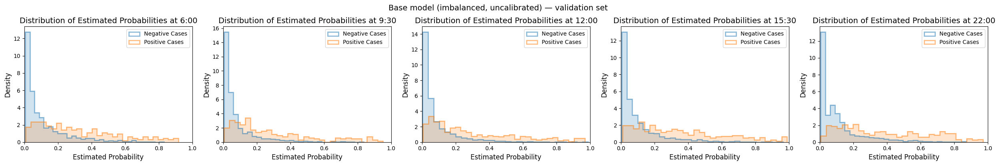

### Calibration plots

A calibration plot shows how well a model's predicted probabilities match actual outcomes.

- X-axis (Mean Predicted Probability): The model's predicted probabilities, ordered from 0 to 1, grouped into bins, either using the uniform or the quantile strategy (see below).
- Y-axis (Fraction of Positives): The observed proportion of admissions for visits in that group.

A perfectly calibrated model would align its points along the diagonal line, meaning a 70% predicted probability means the event happens 70% of the time.

Uniform vs Quantile Strategies:

- Uniform: Divides predictions into equal-width probability bins (e.g., 0.0-0.1, 0.1-0.2), so some bins may have few or many points.
- Quantile: Ensures each bin has the same number of predictions, regardless of how wide or narrow each bin's probability range is.

Below, we see reasonable calibration at the lower end, but deteriorating towards the higher end.

```python
# without balanced training
from patientflow.viz.calibration import plot_calibration

plot_calibration(
    trained_models=trained_models,
    test_visits=valid_visits,
    show=True,
    # strategy="quantile",  # optional
    suptitle="Base model (imbalanced, uncalibrated) — validation set",
)

```

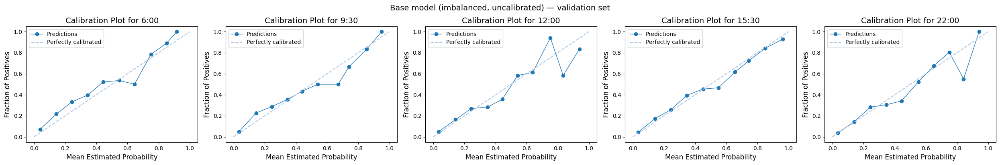

### MADCAP (Model Accuracy Diagnostic Calibration Plot)

A MADCAP (Model Accuracy Diagnostic Calibration Plot) visually compares the predicted probabilities from a model with the actual outcomes (e.g., admissions or events) in a dataset. This plot helps to assess how well the model's predicted probabilities align with the observed values.

The blue line represents the cumulative predicted outcomes, which are derived by summing the predicted probabilities as we move through the validation set, ordered by increasing probability.
The orange line represents the cumulative observed outcomes, calculated based on the actual labels in the dataset, averaged over the same sorted order of predicted probabilities.

If the model is well calibrated, these two lines will closely follow each other. If the model discriminates well between positive and negative classes the curves will bow to the bottom left.

Below, we see that some models under-predict the likelihood of admissions, as the blue line (predicted outcomes) falls below the orange line (actual outcomes). The models are assigning lower probabilities than they should, meaning that (later) we will under-predict the number of beds needed for these patients.

```python
## without balanced training
from patientflow.viz.madcap import plot_madcap
plot_madcap(
    trained_models=trained_models,
    test_visits=valid_visits,
    show=True,
    suptitle="Base model (imbalanced, uncalibrated) — validation set",
)

```

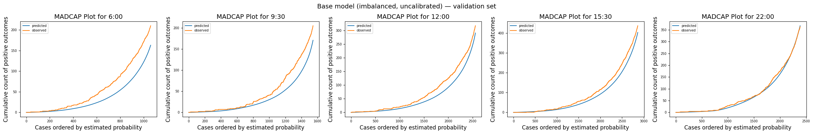

## Inspecting a balanced model

These results are not bad, but it is common to attempt to handle unbalanced classes by undersampling the majority class.

The `train_classifier()` function will balance the training set, if `use_balanced_training` is set to True, as shown below.

```python
from patientflow.train.classifiers import train_classifier
from patientflow.load import get_model_key

trained_models = {}

# Loop through each prediction time
for prediction_time in prediction_times:
    print(f"Training model for {prediction_time}")
    model = train_classifier(
        train_visits=train_visits,
        valid_visits=valid_visits,
        grid={"n_estimators": [20, 30, 40]},
        exclude_from_training_data=exclude_from_training_data,
        ordinal_mappings=ordinal_mappings,
        prediction_time=prediction_time,
        visit_col="visit_number",
        calibrate_probabilities=False,
        use_balanced_training=True,
        calibration_visits=calibration_visits,
    )

    model_name = 'admissions'
    model_key = get_model_key(model_name, prediction_time)

    trained_models[model_key] = model

```

    Training model for (22, 0)


    Training model for (15, 30)


    Training model for (6, 0)


    Training model for (12, 0)


    Training model for (9, 30)

From the plots below, we see improved discrimination. There are positive cases clustered at the right hand end of the distribution plot. However, this gain has come at the cost of much worse calibration when the models are applied to the validation set, without undersampling the majority class, as shown in the calibration plot and MADCAP plots.

```python
from patientflow.viz.estimated_probabilities import plot_estimated_probabilities
from patientflow.viz.calibration import plot_calibration
from patientflow.viz.madcap import plot_madcap

plot_estimated_probabilities(
    trained_models=trained_models,
    test_visits=valid_visits,
    show=True,
    suptitle="Balanced model (uncalibrated) — validation set",
)
plot_calibration(
    trained_models=trained_models,
    test_visits=valid_visits,
    show=True,
    # strategy="quantile",  # optional
    suptitle="Balanced model (uncalibrated) — validation set",
)

plot_madcap(
    trained_models=trained_models,
    test_visits=valid_visits,
    show=True,
    suptitle="Balanced model (uncalibrated) — validation set",
)

```

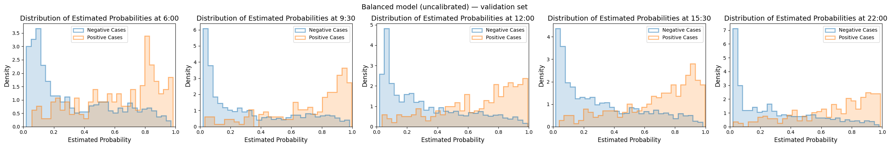

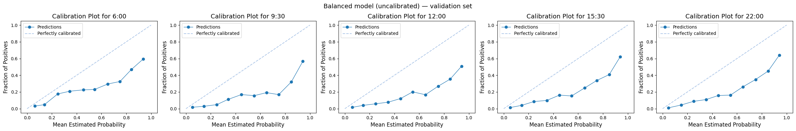

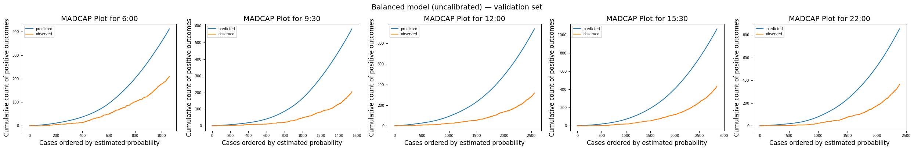

## Recalibrating a balanced model

Balancing the training set improved discrimination, but at the cost of calibration: predicted probabilities no longer match the true admission rates in the full population. That matters here, because later notebooks turn these probabilities into bed-count distributions via Bernoulli trials. A well-separated but poorly scaled probability is not enough.

**Probability calibration** takes the scores from the trained classifier and maps them onto a new scale so that, for example, predictions of 0.3 correspond to events that happen about 30% of the time. It does not retrain the underlying model; it adjusts the output probabilities using labelled examples.

Those labels ideally come from a **dedicated calibration holdout** — a chronological window between training and validation (`calibration_visits` from the splits above). Passing that frame to `train_classifier()` as `calibration_visits` fits the calibrator there and leaves validation set purely for evaluation, so you can judge calibration honestly.

However, `patientflow` will also allow you to calibrate using the validation set: if you omit `calibration_visits`, `train_classifier()` falls back to fitting on validation. Be aware that any calibration plot on that same validation set is then not honest holdout evidence, because the calibrator has already seen those labels.

`train_classifier()` supports two calibration methods via `calibration_method`:

- **sigmoid** (Platt scaling) — fits a logistic curve with only two parameters (a slope and a shift). That low capacity makes it data-efficient: a modest calibration window is usually enough, and it is less prone to overfit when positive cases are sparse.
- **isotonic** — estimates the observed outcome rate across the range of scores as a sequence of flat steps that never decrease (a monotone step function). It can track awkward miscalibration shapes more closely, but that flexibility needs more positive cases and can overfit a thin window.

Both transforms are **monotone**: if patient A scored higher than patient B before calibration, A’s calibrated probability is still at least as high afterwards. Discrimination is therefore usually largely preserved; the visible differences tend to show up in the calibration plot and in how far the probability range is compressed. The cell below trains one balanced model with each method (calibrator fitted on the dedicated calibration window) and compares discrimination and calibration on the validation set.

```python
from patientflow.train.classifiers import train_classifier
from patientflow.viz.estimated_probabilities import plot_estimated_probabilities
from patientflow.viz.calibration import plot_calibration
from patientflow.load import get_model_key


def train_balanced_calibrated(calibration_method, calibration_visits=None):
    models = {}
    for prediction_time in prediction_times:
        print(f"Training {calibration_method} model for {prediction_time}")
        model = train_classifier(
            train_visits=train_visits,
            valid_visits=valid_visits,
            test_visits=test_visits,
            grid={"n_estimators": [20, 30, 40]},
            exclude_from_training_data=exclude_from_training_data,
            ordinal_mappings=ordinal_mappings,
            prediction_time=prediction_time,
            visit_col="visit_number",
            calibrate_probabilities=True,
            calibration_method=calibration_method,
            use_balanced_training=True,
            calibration_visits=calibration_visits,
        )
        models[get_model_key("admissions", prediction_time)] = model
    return models


trained_models_sigmoid = train_balanced_calibrated(
    "sigmoid", calibration_visits=calibration_visits
)
trained_models_isotonic = train_balanced_calibrated(
    "isotonic", calibration_visits=calibration_visits
)

trained_models = trained_models_sigmoid
example_model = next(iter(trained_models.values()))
print(
    "Calibrator fitted on:",
    example_model.training_results.calibration_info["source"]["dataset"],
)
print(
    "Calibration source detail:",
    example_model.training_results.calibration_info["source"],
)

plot_estimated_probabilities(
    trained_models=trained_models_sigmoid,
    test_visits=valid_visits,
    show=True,
    suptitle="Balanced + sigmoid — discrimination on the validation set",
)
plot_estimated_probabilities(
    trained_models=trained_models_isotonic,
    test_visits=valid_visits,
    show=True,
    suptitle="Balanced + isotonic — discrimination on the validation set",
)

plot_calibration(
    trained_models=trained_models_sigmoid,
    test_visits=valid_visits,
    show=True,
    suptitle="Balanced + sigmoid — calibration on the validation set",
)
plot_calibration(
    trained_models=trained_models_isotonic,
    test_visits=valid_visits,
    show=True,
    suptitle="Balanced + isotonic — calibration on the validation set",
)

```

    Training sigmoid model for (22, 0)


    Training sigmoid model for (15, 30)


    Training sigmoid model for (6, 0)


    Training sigmoid model for (12, 0)


    Training sigmoid model for (9, 30)


    Training isotonic model for (22, 0)


    Training isotonic model for (15, 30)


    Training isotonic model for (6, 0)


    Training isotonic model for (12, 0)


    Training isotonic model for (9, 30)


    Calibrator fitted on: calibration
    Calibration source detail: {'dataset': 'calibration', 'single_snapshot_per_visit': False, 'deployment_like_validation': True, 'n_samples': 2482, 'positive_rate': 0.17324738114423852}

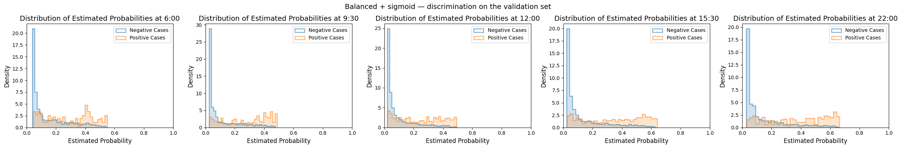

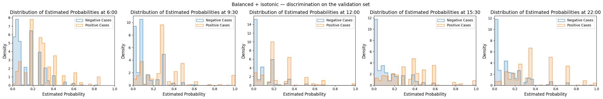


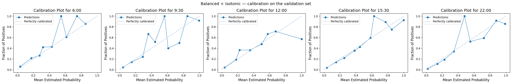

On these validation plots, **sigmoid** is the better choice for this dataset. The calibration curves stay closer to the diagonal and vary smoothly. Isotonic is clearly over-flexible for the size of the calibration window: the reliability curves zigzag, with high-probability bins jumping toward 1.0 and back — a classic sign that the step function has fitted noise rather than a stable remapping.

The discrimination plots show the same story from another angle. Isotonic maps ranges of raw scores onto the same calibrated value (the flats of the step function), so predicted probabilities bunch at a few discrete levels. Sigmoid applies a smooth curve, so the distributions stay more continuous — though calibration still typically compresses the upper end of the probability range.

The rest of this notebook therefore continues with the sigmoid-calibrated models.

### How large should the calibration window be?

There is no universal answer — do not treat any single `n_samples` value from this notebook as a target.

After training, inspect `example_model.training_results.calibration_info['source']`. Two fields are especially useful:

- `n_samples`: the number of rows used to fit the calibrator. A longer calendar window usually means a larger `n_samples`, but the count also depends on how busy that period was and on whether one or many snapshots per visit are kept.
- `positive_rate`: the share of those rows with the positive label (here, admission). What matters for a stable calibrator is roughly `n_samples * positive_rate` — the number of positive cases — not `n_samples` alone. A large sample with almost no positives can still give unreliable calibrated probabilities.

What to do with them:

1. Prefer enough positive cases for the calibration method you chose. Sigmoid (Platt scaling) usually tolerates a thinner window than isotonic regression. If the implied positive count looks thin, lengthen the calibration window or switch to sigmoid before trusting the calibrated probabilities.
2. Judge calibration on the held-out validation set, not on the calibration window itself — that is the point of keeping validation eval-only.
3. If you need more calibration data, lengthen the calibration window by moving its boundary with training where you can. Avoid fitting the calibrator on validation while still evaluating on all of validation. Moving early validation days into a proper calibration window and evaluating only on what remains stays honest, but shrinks the set you use for early model selection.
4. Remember that a single calibrator is fitted on all of the classifier's scores together. Subgroups (for example hospital service) are input features, not separate calibration strata, so a rare subgroup can still be poorly calibrated even when overall `n_samples` looks adequate.

In practice, start with a contiguous post-training window long enough that `n_samples` and the implied positive count look plausible for your method, then confirm on validation plots before settling on both the window dates and the calibration method.

Putting that together: below are the three evaluation plots for the balanced model with sigmoid calibration fitted on the dedicated calibration window, scored on the validation set.

```python
from patientflow.viz.madcap import plot_madcap

plot_estimated_probabilities(
    trained_models=trained_models,
    test_visits=valid_visits,
    show=True,
    suptitle="Balanced + sigmoid — discrimination on the validation set",
)
plot_calibration(
    trained_models=trained_models,
    test_visits=valid_visits,
    show=True,
    suptitle="Balanced + sigmoid — calibration on the validation set",
)
plot_madcap(
    trained_models=trained_models,
    test_visits=valid_visits,
    show=True,
    suptitle="Balanced + sigmoid — MADCAP on the validation set",
)

```


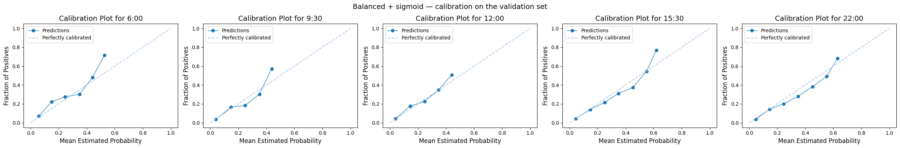

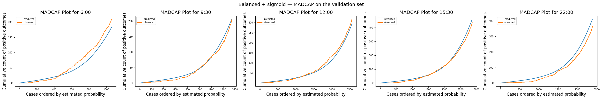

## Checking for bias across patient groups

Overall calibration and discrimination can look acceptable while performance still differs systematically across subgroups. That is a form of bias worth checking before deployment: a model that under-predicts admission for older patients, or that is poorly calibrated for children, will feed distorted bed-count distributions for those groups even if the pooled plots look fine.

One practical check is to repeat the MADCAP view within subgroups. Here we stratify by age group. Analysis like this helps understand the limitations of the modelling and consider alternatives — for example training a different model for older people (if there is enough data), or gathering more training data for under-represented groups before deployment.

In the plots below, performance is worse for children overall. There are fewer of them in the data, which can be seen by comparing the y-axis limits; the y-axis maximum is the total number of snapshots in the validation set that were present at the prediction time. In general there are twice as many adults as over-65s (except at 22:00), and very few children. The models perform poorly for children, and best for adults under 65. They tend to under-predict for older people, especially at 22:00 and 06:00.

```python
from patientflow.viz.madcap import plot_madcap_by_group

plot_madcap_by_group(
    trained_models=trained_models,
    test_visits=valid_visits,
    grouping_var="age_group",
    grouping_var_name="Age Group",
    plot_difference=False,
    show=True,
)

```

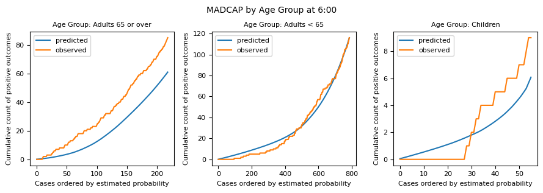

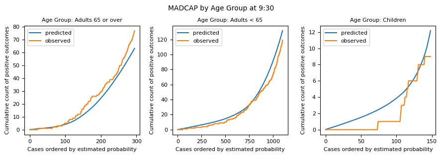

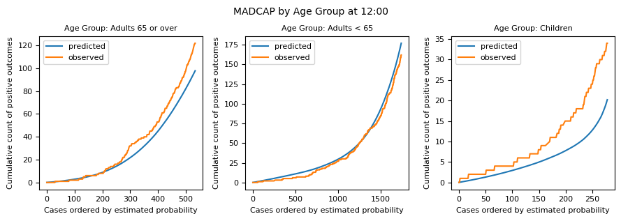

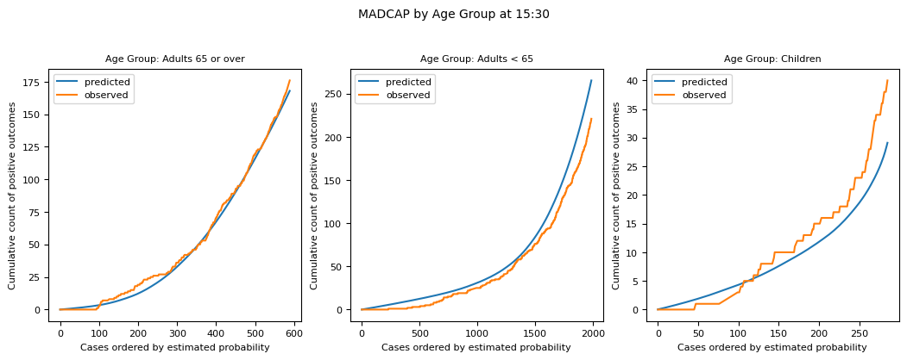

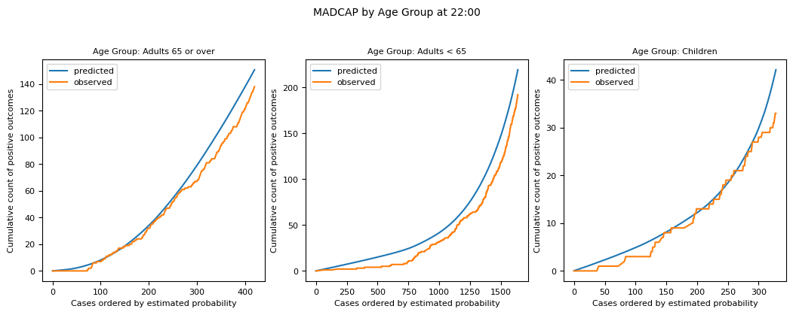

## Feature importances and SHAP plots

`patientflow` offers functions that generate SHAP and feature importance plots for each prediction time.

```python
from patientflow.viz.features import plot_features

plot_features(
    trained_models,
    show=True,
)

```

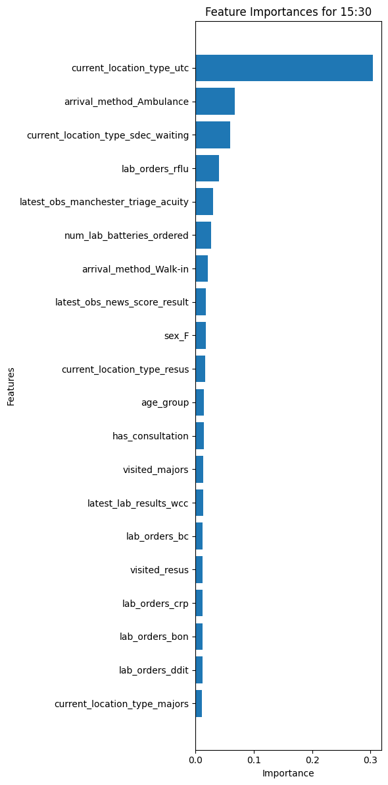

Note that the SHAP package is not loaded by default, due to dependency issues. You will need to pip install it here to generate the SHAP plots.

```python
# !pip install shap
```

```python
from patientflow.viz.shap import plot_shap

plot_shap(
    trained_models,
    valid_visits,
    show=True,
)

```

    Predicted classification (not admitted, admitted):  [670 391]

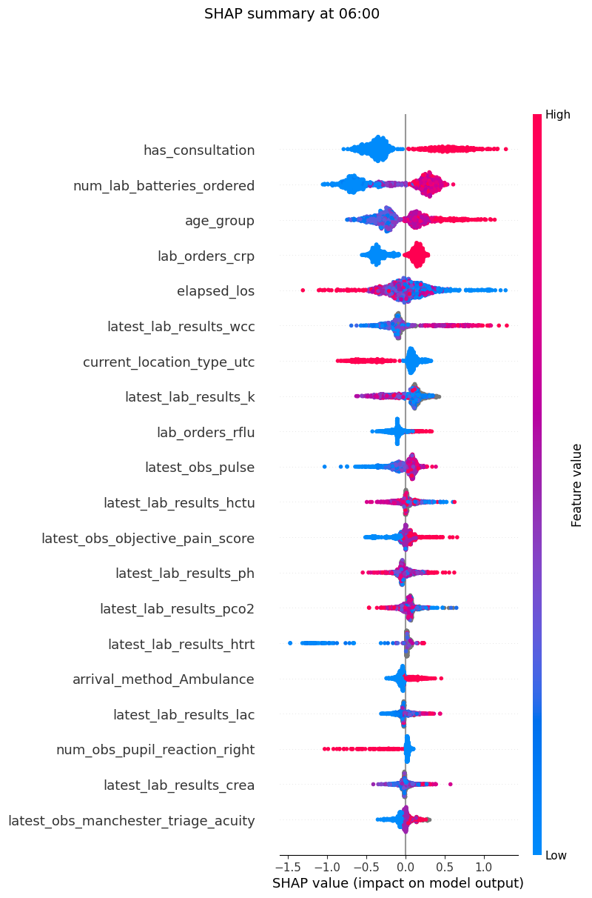

    Predicted classification (not admitted, admitted):  [995 549]

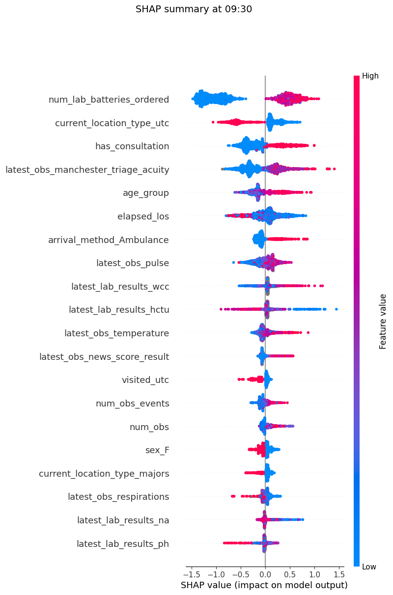

    Predicted classification (not admitted, admitted):  [1739  821]

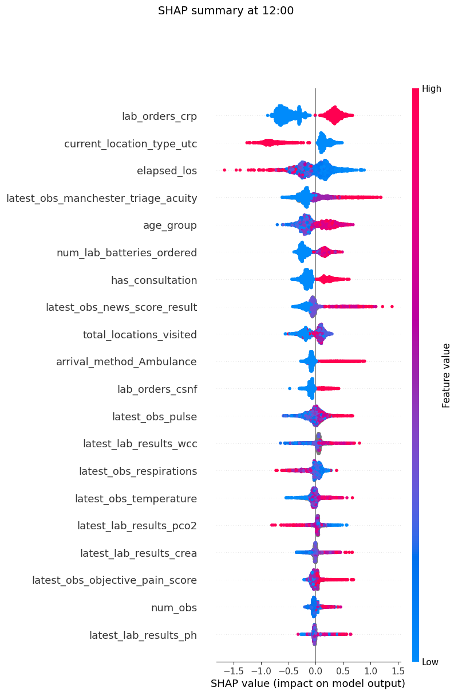

    Predicted classification (not admitted, admitted):  [1886  976]

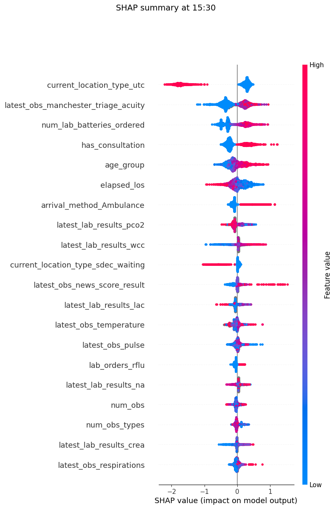

    Predicted classification (not admitted, admitted):  [1615  773]

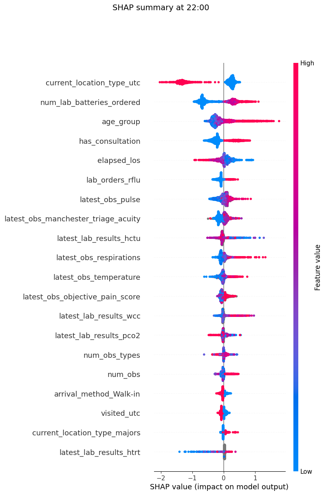

## When to look at the test set

Everything above should be done on the **validation** set while you are still iterating: choosing between sigmoid and isotonic, checking that the calibrator was fitted on a separate window, judging the three pooled plots, looking for subgroup bias, and inspecting feature importances and SHAP values. If the SHAP or importance plots suggest dropping, adding or transforming features — or the bias checks suggest a different modelling approach for some groups — make those changes and re-check on validation. Reach for the **test** set only once you are content with those settings. Looking at it earlier risks tuning decisions to a peek at final holdout performance.

Other notebooks in this series show plots on the test set for continuity with published figures. The cells below do the same, with that caveat: treat them as a final look, not as material for further model selection.

```python
plot_estimated_probabilities(
    trained_models=trained_models,
    test_visits=test_visits,
    show=True,
    suptitle="Balanced + sigmoid — discrimination on the test set",
)
plot_calibration(
    trained_models=trained_models,
    test_visits=test_visits,
    show=True,
    suptitle="Balanced + sigmoid — calibration on the test set",
)
plot_madcap(
    trained_models=trained_models,
    test_visits=test_visits,
    show=True,
    suptitle="Balanced + sigmoid — MADCAP on the test set",
)

```

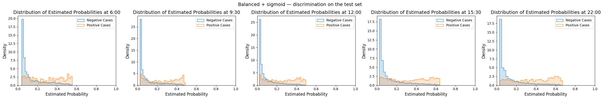

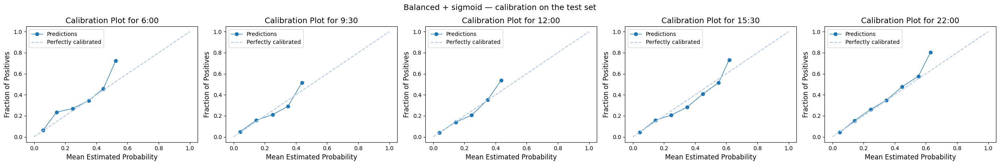

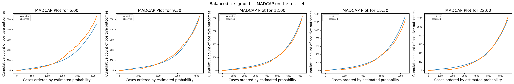

## Conclusion

Here I have shown how visualisations within `patientflow` can help you

- assess the discrimination and calibration of your models
- choose a calibration method and a calibration window to suit your data
- identify areas of weakness by comparing predictions across patient groups
- inspect feature importances and SHAP plots while iterating on validation

I have also shown how using a balanced training set, then re-calibrating on a dedicated chronological window, can improve discrimination. Iterate on validation, including bias and feature checks, and reserve the test set for a final look once you are content with the settings.

This notebook concludes the set covering patient snapshots. We have created predicted probabilities for each patient, based on what is known about them at the time of the snapshot. However, bed managers really want predictions for the whole cohort of patients at a time. This is where `patientflow` comes into its own. Notebook **2d** explores the public datasets; notebook **3a** shows how to create group snapshots.
