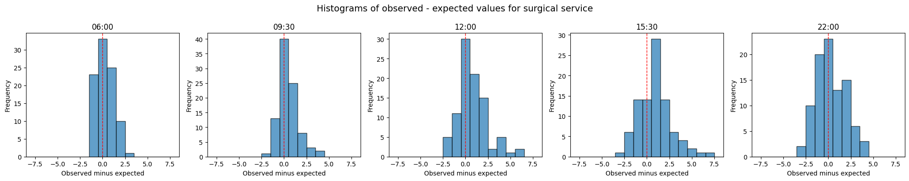
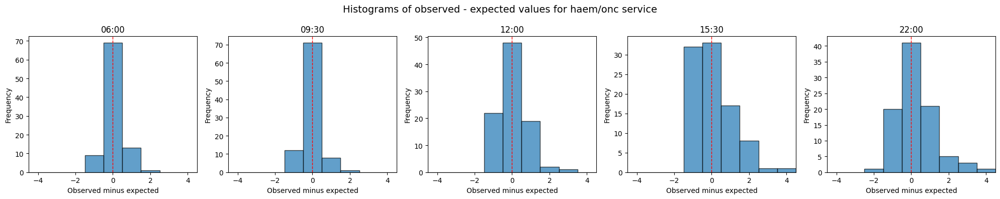
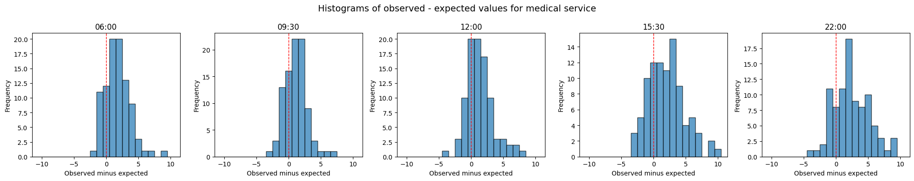
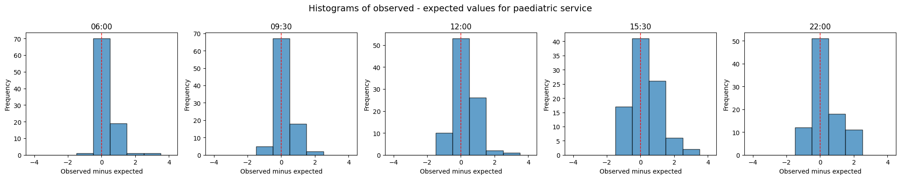

# 3d. Evaluate bed demand predictions by hospital service

In notebook 3c I predicted bed counts by hospital service for one group snapshot. Here I evaluate those predictions across the test set using the approaches from notebook 3b (histograms of observed minus expected, and EPUDD plots).

I also ask whether routing patients to specialties using consult sequences (the model from 3c) beats a naive alternative: give every patient the same specialty mix, taken from training-set averages (for example 45% medical, 30% surgical, …). A table of mean absolute errors (MAE) summarises that comparison across services; EPUDD plots show _how_ predictions differ from observations for individual services.

### Data requirements

| Column / dataset                                                                | Used for                                             |
| ------------------------------------------------------------------------------- | ---------------------------------------------------- |
| `ed_visits` with `snapshot_date`, `prediction_time`, `is_admitted`, `specialty` | ED-current bed demand (`admitted_at_some_point`)     |
| `inpatient_arrivals` with `specialty`                                           | Baseline specialty proportions from the training set |

You can request the UCLH datasets on [Zenodo](https://zenodo.org/records/14866057). If you do not have the public data, set `data_folder_name` to `'data-synthetic'`.

For the same PMFs through `patientflow.evaluate` (`EvaluationInputsBuilder` and `run_evaluation`), see notebook **4d**.

```python
# Reload functions every time
%load_ext autoreload
%autoreload 2

```

## Load data and train models

`prepare_prediction_inputs` trains admission models at each prediction time and a hospital service model, as in notebooks 3b and 3c.

```python
from datetime import timedelta

import pandas as pd

from patientflow.load import get_model_key
from patientflow.model_artifacts import ServiceModels
from patientflow.prepare import create_temporal_splits
from patientflow.predict.demand import FlowSelection
from patientflow.train.emergency_demand import prepare_prediction_inputs

data_folder_name = "data-public"
prediction_inputs = prepare_prediction_inputs(data_folder_name, verbose=False)

admissions_models = prediction_inputs["admission_models"]
spec_model = prediction_inputs["specialty_model"]
ed_visits = prediction_inputs["ed_visits"]
inpatient_arrivals = prediction_inputs["inpatient_arrivals"]
specialties = prediction_inputs["specialties"]
params = prediction_inputs["config"]

model_name = "admissions"
prediction_window = timedelta(minutes=params["prediction_window"])
prediction_times = list(params["prediction_times"])

start_training_set = params["start_training_set"]
start_calibration_set = params["start_calibration_set"]
start_validation_set = params["start_validation_set"]
start_test_set = params["start_test_set"]
end_test_set = params["end_test_set"]

_, _, _, test_visits_df = create_temporal_splits(
    ed_visits,
    start_training_set,
    start_validation_set,
    start_test_set,
    end_test_set,
    col_name="snapshot_date",
    visit_col="visit_number",
    verbose=False,
    start_calibration=start_calibration_set,
)

test_snapshot_dates = [
    d.date()
    for d in pd.date_range(start_test_set, end_test_set, freq="D", inclusive="left")
]

```

## Generate predicted distributions by hospital service

Notebook **3c** called `get_prob_dist` for **one** group snapshot at a time, weighting admission probabilities by the specialty model. Here I use **`get_prob_dist_by_service`** to build the same specialty-weighted PMFs for **every** prediction time and snapshot date in the test set, and store the results as `{model_key: {specialty: {snapshot_date: leaf}}}` where each **leaf** is a small dict holding `agg_predicted` (the PMF) and `agg_observed` (the count on that snapshot).

This is also the first use in the 3x notebooks of two production helpers that notebook **4a** explains in full:

- **`FlowSelection`** — a small config object saying which patient flows to include. Here I use `FlowSelection.custom(...)` with only `include_ed_current=True`, because this notebook evaluates bed demand from patients already in the ED.
- **`ServiceModels`** — bundles the trained models for one prediction time. Here that is the admission classifier and specialty router.

The plotting helpers in the next sections read that nested structure:

- **`calc_mae_mpe`** — mean absolute error and mean percentage error across snapshot dates (scalar summary per prediction time).
- **`plot_deltas`** — histograms of observed minus expected values from those scalars.
- **`plot_epudd`** — EPUDD charts comparing the full predicted distribution to observed counts at each snapshot.

```python
from patientflow.aggregate import get_prob_dist_by_service
from patientflow.predictors.value_to_outcome_predictor import ConstantSpecialtyProbs

# FlowSelection: which patient flows to include in the prediction.
# This notebook evaluates ED-current bed demand only.
flow_sel_ed_current = FlowSelection.custom(
    include_ed_current=True,
    include_ed_yta=False,  # yet-to-arrive ED admissions
    include_non_ed_yta=False,  # yet-to-arrive non-ED emergency admissions
    include_elective_yta=False,
    include_transfers_in=False,
    include_departures=False,
)


def build_ed_current_distributions(spec_predictor) -> dict:
    """Build {model_key: {specialty: {snapshot_date: leaf}}} for one routing model."""
    by_model_key: dict = {}
    for prediction_time in prediction_times:
        model_key = get_model_key(model_name, prediction_time)

        # ServiceModels: bundle the models needed for this prediction time.
        service_models = ServiceModels(
            prediction_time=prediction_time,
            prediction_window=prediction_window,
            ed_classifier=admissions_models[model_key],
            spec_model=spec_predictor,
        )

        # Returns {specialty: {snapshot_date: {agg_predicted, agg_observed}}}.
        by_specialty = get_prob_dist_by_service(
            test_visits_df,
            test_snapshot_dates,
            prediction_time,
            service_models,
            specialties,
            prediction_window,
            flow_selection=flow_sel_ed_current,
            component="arrivals",
            observation_mode="admitted_at_some_point",
            use_admission_in_window_prob=False,
            verbose=False,
        )
        by_model_key[model_key] = by_specialty
    return by_model_key


prob_dist_dict_all = build_ed_current_distributions(spec_model)

```

## Evaluate predictions by hospital service

Use `calc_mae_mpe` and `plot_deltas` for scalar summaries and delta histograms across snapshot dates, and `plot_epudd` to inspect distribution shape.

```python
from patientflow.evaluate import calc_mae_mpe
from patientflow.viz.observed_against_expected import plot_deltas

for specialty in specialties:
    specialty_prob_dist = {
        model_key: dist_dict[specialty]
        for model_key, dist_dict in prob_dist_dict_all.items()
    }
    results = calc_mae_mpe(specialty_prob_dist)
    plot_deltas(
        results,
        suptitle=f"Histograms of observed - expected values for {specialty} service",
        show=True,
    )

```









```python
from patientflow.viz.epudd import plot_epudd

for specialty in specialties:
    specialty_prob_dist = {
        model_key: dist_dict[specialty]
        for model_key, dist_dict in prob_dist_dict_all.items()
    }
    plot_epudd(
        prediction_times,
        specialty_prob_dist,
        model_name=model_name,
        suptitle=f"EPUDD plots for {specialty} service (sequence predictor)",
    )

```


## Compare with a baseline: average specialty proportions

The baseline gives every patient the same probability of admission to each hospital service, based on training-set averages from `inpatient_arrivals`. Positive `mae_reduction` means the sequence predictor has lower mean absolute error than the baseline.

```python
inpatient_arrivals = inpatient_arrivals.copy()
inpatient_arrivals["arrival_datetime"] = pd.to_datetime(
    inpatient_arrivals["arrival_datetime"], utc=True
)
train_inpatient_arrivals_df, _, _, _ = create_temporal_splits(
    inpatient_arrivals,
    start_training_set,
    start_validation_set,
    start_test_set,
    end_test_set,
    col_name="arrival_datetime",
    verbose=False,
    start_calibration=start_calibration_set,
)

baseline_probs = (
    train_inpatient_arrivals_df["specialty"].value_counts(normalize=True).to_dict()
)
baseline_spec_model = ConstantSpecialtyProbs(baseline_probs)
prob_dist_dict_all_baseline = build_ed_current_distributions(baseline_spec_model)

comparison_rows = []
for specialty in specialties:
    model_dist = {
        model_key: dist_dict[specialty]
        for model_key, dist_dict in prob_dist_dict_all.items()
    }
    baseline_dist = {
        model_key: dist_dict[specialty]
        for model_key, dist_dict in prob_dist_dict_all_baseline.items()
    }
    model_results = calc_mae_mpe(model_dist)
    baseline_results = calc_mae_mpe(baseline_dist)
    for model_key in model_results:
        model_mae = model_results[model_key]["mae"]
        baseline_mae = baseline_results[model_key]["mae"]
        comparison_rows.append(
            {
                "specialty": specialty,
                "model_key": model_key,
                "mae_sequence": model_mae,
                "mae_baseline": baseline_mae,
                "mae_reduction": baseline_mae - model_mae,
            }
        )

comparison_df = pd.DataFrame(comparison_rows)
from IPython.display import display

display(comparison_df)

```

<div>
<style scoped>
    .dataframe tbody tr th:only-of-type {
        vertical-align: middle;
    }

    .dataframe tbody tr th {
        vertical-align: top;
    }

    .dataframe thead th {
        text-align: right;
    }

</style>
<table border="1" class="dataframe">
  <thead>
    <tr style="text-align: right;">
      <th></th>
      <th>specialty</th>
      <th>model_key</th>
      <th>mae_sequence</th>
      <th>mae_baseline</th>
      <th>mae_reduction</th>
    </tr>
  </thead>
  <tbody>
    <tr>
      <th>0</th>
      <td>surgical</td>
      <td>admissions_0600</td>
      <td>0.801679</td>
      <td>0.858141</td>
      <td>0.056463</td>
    </tr>
    <tr>
      <th>1</th>
      <td>surgical</td>
      <td>admissions_0930</td>
      <td>0.861672</td>
      <td>0.887846</td>
      <td>0.026173</td>
    </tr>
    <tr>
      <th>2</th>
      <td>surgical</td>
      <td>admissions_1200</td>
      <td>1.277388</td>
      <td>1.437351</td>
      <td>0.159963</td>
    </tr>
    <tr>
      <th>3</th>
      <td>surgical</td>
      <td>admissions_1530</td>
      <td>1.560773</td>
      <td>1.667173</td>
      <td>0.106400</td>
    </tr>
    <tr>
      <th>4</th>
      <td>surgical</td>
      <td>admissions_2200</td>
      <td>1.380850</td>
      <td>1.408271</td>
      <td>0.027421</td>
    </tr>
    <tr>
      <th>5</th>
      <td>haem/onc</td>
      <td>admissions_0600</td>
      <td>0.399544</td>
      <td>0.484354</td>
      <td>0.084809</td>
    </tr>
    <tr>
      <th>6</th>
      <td>haem/onc</td>
      <td>admissions_0930</td>
      <td>0.390813</td>
      <td>0.491466</td>
      <td>0.100653</td>
    </tr>
    <tr>
      <th>7</th>
      <td>haem/onc</td>
      <td>admissions_1200</td>
      <td>0.577235</td>
      <td>0.628655</td>
      <td>0.051420</td>
    </tr>
    <tr>
      <th>8</th>
      <td>haem/onc</td>
      <td>admissions_1530</td>
      <td>0.809756</td>
      <td>0.872876</td>
      <td>0.063120</td>
    </tr>
    <tr>
      <th>9</th>
      <td>haem/onc</td>
      <td>admissions_2200</td>
      <td>0.721199</td>
      <td>0.801925</td>
      <td>0.080726</td>
    </tr>
    <tr>
      <th>10</th>
      <td>medical</td>
      <td>admissions_0600</td>
      <td>1.977793</td>
      <td>2.073985</td>
      <td>0.096192</td>
    </tr>
    <tr>
      <th>11</th>
      <td>medical</td>
      <td>admissions_0930</td>
      <td>1.572897</td>
      <td>1.712363</td>
      <td>0.139466</td>
    </tr>
    <tr>
      <th>12</th>
      <td>medical</td>
      <td>admissions_1200</td>
      <td>1.747010</td>
      <td>1.874020</td>
      <td>0.127010</td>
    </tr>
    <tr>
      <th>13</th>
      <td>medical</td>
      <td>admissions_1530</td>
      <td>2.638974</td>
      <td>2.931093</td>
      <td>0.292119</td>
    </tr>
    <tr>
      <th>14</th>
      <td>medical</td>
      <td>admissions_2200</td>
      <td>2.859526</td>
      <td>3.077419</td>
      <td>0.217893</td>
    </tr>
    <tr>
      <th>15</th>
      <td>paediatric</td>
      <td>admissions_0600</td>
      <td>0.308607</td>
      <td>0.464199</td>
      <td>0.155592</td>
    </tr>
    <tr>
      <th>16</th>
      <td>paediatric</td>
      <td>admissions_0930</td>
      <td>0.329154</td>
      <td>0.466705</td>
      <td>0.137551</td>
    </tr>
    <tr>
      <th>17</th>
      <td>paediatric</td>
      <td>admissions_1200</td>
      <td>0.537058</td>
      <td>0.577504</td>
      <td>0.040446</td>
    </tr>
    <tr>
      <th>18</th>
      <td>paediatric</td>
      <td>admissions_1530</td>
      <td>0.650287</td>
      <td>0.751931</td>
      <td>0.101644</td>
    </tr>
    <tr>
      <th>19</th>
      <td>paediatric</td>
      <td>admissions_2200</td>
      <td>0.740811</td>
      <td>0.794429</td>
      <td>0.053618</td>
    </tr>
  </tbody>
</table>
</div>

### Illustrative EPUDD: baseline vs sequence predictor

Scalars above summarise all services. Below I show EPUDD pairs for **haem/onc** and **paediatric**, where the baseline tends to over-predict most clearly.

```python
from IPython.display import display

for specialty in ["haem/onc", "paediatric"]:
    model_dist = {
        model_key: dist_dict[specialty]
        for model_key, dist_dict in prob_dist_dict_all.items()
    }
    baseline_dist = {
        model_key: dist_dict[specialty]
        for model_key, dist_dict in prob_dist_dict_all_baseline.items()
    }
    print(f"\nEPUDD for {specialty}: baseline (historical proportions)")
    plot_epudd(
        prediction_times,
        baseline_dist,
        model_name=model_name,
        suptitle=f"{specialty} — baseline specialty proportions",
    )
    print(f"EPUDD for {specialty}: sequence predictor")
    plot_epudd(
        prediction_times,
        model_dist,
        model_name=model_name,
        suptitle=f"{specialty} — sequence predictor",
    )

```

    EPUDD for haem/onc: baseline (historical proportions)


    EPUDD for haem/onc: sequence predictor


    EPUDD for paediatric: baseline (historical proportions)


    EPUDD for paediatric: sequence predictor


## Summary

In this notebook I have shown how to evaluate predicted bed count distributions by hospital service, using the evaluation approaches introduced in notebook 3b. I built specialty-weighted PMFs across the test set with `get_prob_dist_by_service`, summarised calibration with `calc_mae_mpe`, and used EPUDD plots to diagnose where predicted and observed distributions differ.

I also compared the sequence specialty predictor from notebook 3c against a baseline that gives every patient the same specialty mix, based on average admission proportions from the training set. Scalar MAE reductions across services support triage; illustrative EPUDD pairs show _how_ the baseline and the sequence predictor diverge for individual services.

For the same PMFs run through `patientflow.evaluate` (`EvaluationInputsBuilder` and `run_evaluation`), see notebook **4d**.

In notebooks **3e** and **3f**, I extend evaluation to patients yet to arrive. The **4x** notebooks then show how these functions are assembled into a production system at University College London Hospital to predict emergency demand.
