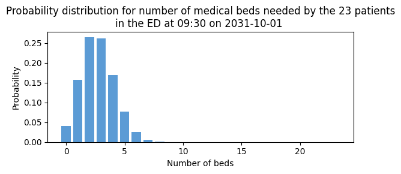
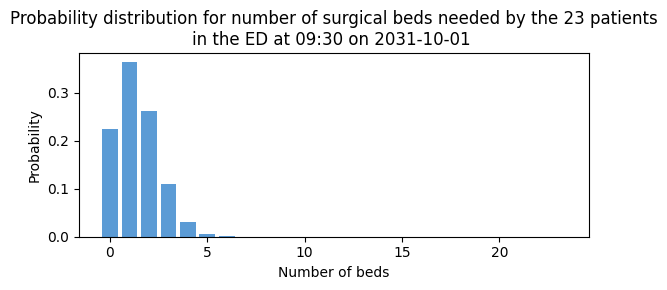
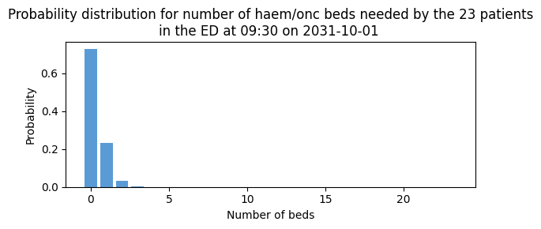
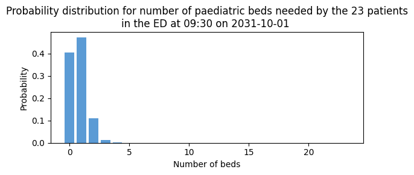
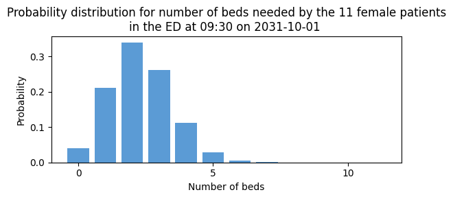

# Predict bed count distributions for subgroups

It is often the case that pressures build up on certain areas of the hospital, or for subgroups of patients. For example, due to infections in the community, there might be particulary demand for respiratory specialties, or for male geriatric beds.

In this notebook I show how `patientflow` functions can be used to create predictions for some subgroup which might be

- specific areas of the hospital (eg medical or paediatric beds)
- sub-groups defined by a demographic characteristic (eg sex)

I will first demonsrate the use of a `SequencePredictor` class, that can be used to predict each patient's probability of admission to a clinical area if they are admitted. Here I show predictions to four specialties: medical, surgical, haematology/oncology or paediatric. I'll load real patient data and show how the `SequencePredictor` is trained using sequences of consult requests made while patients were in the ED.

If we assume that two events - a patient being admitted, and a patient requiring a particular specialty if admitted - are independent, the probabilities of those events can be multiplied to give a probabilty of admission to a specialty. I'll show the use of this approach to generate bed count distributions for each specialty.

I'll also demonstrate the disaggregation of predicted bed counts by sex.

## Loading real patient data

Following the approaach taken in the previous notebook, I'll first load some real patient data.

```python
# Reload functions every time
%load_ext autoreload
%autoreload 2
```

```python
import pandas as pd
from patientflow.load import set_file_paths, load_data, load_config_file

# set project root
from patientflow.load import set_project_root
project_root = set_project_root()

# set file paths
data_file_path, media_file_path, model_file_path, config_path = set_file_paths(
        project_root,
        data_folder_name='data-public', # change this to data-synthetic if you don't have the public dataset
        verbose=False)

# load the data
ed_visits = load_data(data_file_path,
                    file_name='ed_visits.csv',
                    index_column = 'snapshot_id',
                    sort_columns = ["visit_number", "snapshot_date", "prediction_time"],
                    eval_columns = ["prediction_time", "consultation_sequence", "final_sequence"])
ed_visits.snapshot_date = pd.to_datetime(ed_visits.snapshot_date).dt.date

# load the config file to set the dates for the training, validation and test sets
params = load_config_file(config_path)
start_training_set, start_validation_set, start_test_set, end_test_set = params["start_training_set"], params["start_validation_set"], params["start_test_set"], params["end_test_set"]

# apply the temporal splits
from datetime import date
from patientflow.prepare import create_temporal_splits

# create the temporal splits
train_visits, valid_visits, test_visits = create_temporal_splits(
    ed_visits,
    start_training_set,
    start_validation_set,
    start_test_set,
    end_test_set,
    col_name="snapshot_date", # states which column contains the date to use when making the splits
    visit_col="visit_number", # states which column contains the visit number to use when making the splits

)

```

    Inferred project root: /Users/zellaking/Repos/patientflow
    Split sizes: [53801, 6519, 19494]

## Train a model to predict probability of admission to each specialty

In this example, the data used as input comprise sequences of consults issued while the patient was in the ED. Below, the `consultation_sequence` column shows the ordered sequence of consultation requests up to the moment of the snapshot, and the `final_sequence` shows the ordered sequence at the end of the ED visit. The `specialty` column records which specialty the patient was admitted to.

```python
ed_visits[(ed_visits.is_admitted) & (ed_visits.prediction_time == (9,30))][['consultation_sequence', 'final_sequence', 'specialty']].head(10)
```

<div>
<style scoped>
    .dataframe tbody tr th:only-of-type {
        vertical-align: middle;
    }

    .dataframe tbody tr th {
        vertical-align: top;
    }

    .dataframe thead th {
        text-align: right;
    }

</style>
<table border="1" class="dataframe">
  <thead>
    <tr style="text-align: right;">
      <th></th>
      <th>consultation_sequence</th>
      <th>final_sequence</th>
      <th>specialty</th>
    </tr>
    <tr>
      <th>snapshot_id</th>
      <th></th>
      <th></th>
      <th></th>
    </tr>
  </thead>
  <tbody>
    <tr>
      <th>59</th>
      <td>['surgical']</td>
      <td>['surgical']</td>
      <td>surgical</td>
    </tr>
    <tr>
      <th>117</th>
      <td>[]</td>
      <td>['surgical']</td>
      <td>surgical</td>
    </tr>
    <tr>
      <th>124</th>
      <td>[]</td>
      <td>['surgical']</td>
      <td>surgical</td>
    </tr>
    <tr>
      <th>127</th>
      <td>[]</td>
      <td>['surgical']</td>
      <td>surgical</td>
    </tr>
    <tr>
      <th>141</th>
      <td>[]</td>
      <td>['surgical']</td>
      <td>surgical</td>
    </tr>
    <tr>
      <th>218</th>
      <td>['ambulatory']</td>
      <td>['ambulatory']</td>
      <td>NaN</td>
    </tr>
    <tr>
      <th>452</th>
      <td>['obs_gyn', 'obs_gyn']</td>
      <td>['obs_gyn', 'obs_gyn']</td>
      <td>surgical</td>
    </tr>
    <tr>
      <th>474</th>
      <td>[]</td>
      <td>['paeds']</td>
      <td>paediatric</td>
    </tr>
    <tr>
      <th>485</th>
      <td>[]</td>
      <td>['acute']</td>
      <td>medical</td>
    </tr>
    <tr>
      <th>516</th>
      <td>['surgical']</td>
      <td>['surgical']</td>
      <td>NaN</td>
    </tr>
  </tbody>
</table>
</div>

Below I demonstrate training the model. A rooted decision-tree is used to calculate the probability of an ordered sequence of consultations (observed at the snapshot, which could be none) resulting in each final sequences at the end of the ED visit, and the probabiltity of each of those final sequences being associated with admission to each specialty.

This sequence predictor could be applied to other types of data, such as sequences of ED locations, or sequences of clinical teams. Therefore, the `SequencePredictor` arguments have been given generic names:

- `input_var` - the interim node in the decision tree, observed at the snapshot
- `grouping_var` - the terminal node in the decision tree, observed in this example at the end of the ED visit
- `outcome_var` - the final outcome to be predicted

The `apply_special_category_filtering` argument provides for the handling of certain categories in a specific way. For example, under 18 patients might always be assumed to be visiting paediatric specialties.

```python
from patientflow.predictors.sequence_predictor import SequencePredictor

spec_model = SequencePredictor(
    input_var="consultation_sequence",
    grouping_var="final_sequence",
    outcome_var="specialty",
    apply_special_category_filtering=False,
)

spec_model.fit(train_visits)
```

<style>#sk-container-id-1 {
  /* Definition of color scheme common for light and dark mode */
  --sklearn-color-text: black;
  --sklearn-color-line: gray;
  /* Definition of color scheme for unfitted estimators */
  --sklearn-color-unfitted-level-0: #fff5e6;
  --sklearn-color-unfitted-level-1: #f6e4d2;
  --sklearn-color-unfitted-level-2: #ffe0b3;
  --sklearn-color-unfitted-level-3: chocolate;
  /* Definition of color scheme for fitted estimators */
  --sklearn-color-fitted-level-0: #f0f8ff;
  --sklearn-color-fitted-level-1: #d4ebff;
  --sklearn-color-fitted-level-2: #b3dbfd;
  --sklearn-color-fitted-level-3: cornflowerblue;

  /* Specific color for light theme */
  --sklearn-color-text-on-default-background: var(--sg-text-color, var(--theme-code-foreground, var(--jp-content-font-color1, black)));
  --sklearn-color-background: var(--sg-background-color, var(--theme-background, var(--jp-layout-color0, white)));
  --sklearn-color-border-box: var(--sg-text-color, var(--theme-code-foreground, var(--jp-content-font-color1, black)));
  --sklearn-color-icon: #696969;

  @media (prefers-color-scheme: dark) {
    /* Redefinition of color scheme for dark theme */
    --sklearn-color-text-on-default-background: var(--sg-text-color, var(--theme-code-foreground, var(--jp-content-font-color1, white)));
    --sklearn-color-background: var(--sg-background-color, var(--theme-background, var(--jp-layout-color0, #111)));
    --sklearn-color-border-box: var(--sg-text-color, var(--theme-code-foreground, var(--jp-content-font-color1, white)));
    --sklearn-color-icon: #878787;
  }
}

#sk-container-id-1 {
  color: var(--sklearn-color-text);
}

#sk-container-id-1 pre {
  padding: 0;
}

#sk-container-id-1 input.sk-hidden--visually {
  border: 0;
  clip: rect(1px 1px 1px 1px);
  clip: rect(1px, 1px, 1px, 1px);
  height: 1px;
  margin: -1px;
  overflow: hidden;
  padding: 0;
  position: absolute;
  width: 1px;
}

#sk-container-id-1 div.sk-dashed-wrapped {
  border: 1px dashed var(--sklearn-color-line);
  margin: 0 0.4em 0.5em 0.4em;
  box-sizing: border-box;
  padding-bottom: 0.4em;
  background-color: var(--sklearn-color-background);
}

#sk-container-id-1 div.sk-container {
  /* jupyter's `normalize.less` sets `[hidden] { display: none; }`
     but bootstrap.min.css set `[hidden] { display: none !important; }`
     so we also need the `!important` here to be able to override the
     default hidden behavior on the sphinx rendered scikit-learn.org.
     See: https://github.com/scikit-learn/scikit-learn/issues/21755 */
  display: inline-block !important;
  position: relative;
}

#sk-container-id-1 div.sk-text-repr-fallback {
  display: none;
}

div.sk-parallel-item,
div.sk-serial,
div.sk-item {
  /* draw centered vertical line to link estimators */
  background-image: linear-gradient(var(--sklearn-color-text-on-default-background), var(--sklearn-color-text-on-default-background));
  background-size: 2px 100%;
  background-repeat: no-repeat;
  background-position: center center;
}

/* Parallel-specific style estimator block */

#sk-container-id-1 div.sk-parallel-item::after {
  content: "";
  width: 100%;
  border-bottom: 2px solid var(--sklearn-color-text-on-default-background);
  flex-grow: 1;
}

#sk-container-id-1 div.sk-parallel {
  display: flex;
  align-items: stretch;
  justify-content: center;
  background-color: var(--sklearn-color-background);
  position: relative;
}

#sk-container-id-1 div.sk-parallel-item {
  display: flex;
  flex-direction: column;
}

#sk-container-id-1 div.sk-parallel-item:first-child::after {
  align-self: flex-end;
  width: 50%;
}

#sk-container-id-1 div.sk-parallel-item:last-child::after {
  align-self: flex-start;
  width: 50%;
}

#sk-container-id-1 div.sk-parallel-item:only-child::after {
  width: 0;
}

/* Serial-specific style estimator block */

#sk-container-id-1 div.sk-serial {
  display: flex;
  flex-direction: column;
  align-items: center;
  background-color: var(--sklearn-color-background);
  padding-right: 1em;
  padding-left: 1em;
}


/* Toggleable style: style used for estimator/Pipeline/ColumnTransformer box that is
clickable and can be expanded/collapsed.
- Pipeline and ColumnTransformer use this feature and define the default style
- Estimators will overwrite some part of the style using the `sk-estimator` class
*/

/* Pipeline and ColumnTransformer style (default) */

#sk-container-id-1 div.sk-toggleable {
  /* Default theme specific background. It is overwritten whether we have a
  specific estimator or a Pipeline/ColumnTransformer */
  background-color: var(--sklearn-color-background);
}

/* Toggleable label */
#sk-container-id-1 label.sk-toggleable__label {
  cursor: pointer;
  display: block;
  width: 100%;
  margin-bottom: 0;
  padding: 0.5em;
  box-sizing: border-box;
  text-align: center;
}

#sk-container-id-1 label.sk-toggleable__label-arrow:before {
  /* Arrow on the left of the label */
  content: "▸";
  float: left;
  margin-right: 0.25em;
  color: var(--sklearn-color-icon);
}

#sk-container-id-1 label.sk-toggleable__label-arrow:hover:before {
  color: var(--sklearn-color-text);
}

/* Toggleable content - dropdown */

#sk-container-id-1 div.sk-toggleable__content {
  max-height: 0;
  max-width: 0;
  overflow: hidden;
  text-align: left;
  /* unfitted */
  background-color: var(--sklearn-color-unfitted-level-0);
}

#sk-container-id-1 div.sk-toggleable__content.fitted {
  /* fitted */
  background-color: var(--sklearn-color-fitted-level-0);
}

#sk-container-id-1 div.sk-toggleable__content pre {
  margin: 0.2em;
  border-radius: 0.25em;
  color: var(--sklearn-color-text);
  /* unfitted */
  background-color: var(--sklearn-color-unfitted-level-0);
}

#sk-container-id-1 div.sk-toggleable__content.fitted pre {
  /* unfitted */
  background-color: var(--sklearn-color-fitted-level-0);
}

#sk-container-id-1 input.sk-toggleable__control:checked~div.sk-toggleable__content {
  /* Expand drop-down */
  max-height: 200px;
  max-width: 100%;
  overflow: auto;
}

#sk-container-id-1 input.sk-toggleable__control:checked~label.sk-toggleable__label-arrow:before {
  content: "▾";
}

/* Pipeline/ColumnTransformer-specific style */

#sk-container-id-1 div.sk-label input.sk-toggleable__control:checked~label.sk-toggleable__label {
  color: var(--sklearn-color-text);
  background-color: var(--sklearn-color-unfitted-level-2);
}

#sk-container-id-1 div.sk-label.fitted input.sk-toggleable__control:checked~label.sk-toggleable__label {
  background-color: var(--sklearn-color-fitted-level-2);
}

/* Estimator-specific style */

/* Colorize estimator box */
#sk-container-id-1 div.sk-estimator input.sk-toggleable__control:checked~label.sk-toggleable__label {
  /* unfitted */
  background-color: var(--sklearn-color-unfitted-level-2);
}

#sk-container-id-1 div.sk-estimator.fitted input.sk-toggleable__control:checked~label.sk-toggleable__label {
  /* fitted */
  background-color: var(--sklearn-color-fitted-level-2);
}

#sk-container-id-1 div.sk-label label.sk-toggleable__label,
#sk-container-id-1 div.sk-label label {
  /* The background is the default theme color */
  color: var(--sklearn-color-text-on-default-background);
}

/* On hover, darken the color of the background */
#sk-container-id-1 div.sk-label:hover label.sk-toggleable__label {
  color: var(--sklearn-color-text);
  background-color: var(--sklearn-color-unfitted-level-2);
}

/* Label box, darken color on hover, fitted */
#sk-container-id-1 div.sk-label.fitted:hover label.sk-toggleable__label.fitted {
  color: var(--sklearn-color-text);
  background-color: var(--sklearn-color-fitted-level-2);
}

/* Estimator label */

#sk-container-id-1 div.sk-label label {
  font-family: monospace;
  font-weight: bold;
  display: inline-block;
  line-height: 1.2em;
}

#sk-container-id-1 div.sk-label-container {
  text-align: center;
}

/* Estimator-specific */
#sk-container-id-1 div.sk-estimator {
  font-family: monospace;
  border: 1px dotted var(--sklearn-color-border-box);
  border-radius: 0.25em;
  box-sizing: border-box;
  margin-bottom: 0.5em;
  /* unfitted */
  background-color: var(--sklearn-color-unfitted-level-0);
}

#sk-container-id-1 div.sk-estimator.fitted {
  /* fitted */
  background-color: var(--sklearn-color-fitted-level-0);
}

/* on hover */
#sk-container-id-1 div.sk-estimator:hover {
  /* unfitted */
  background-color: var(--sklearn-color-unfitted-level-2);
}

#sk-container-id-1 div.sk-estimator.fitted:hover {
  /* fitted */
  background-color: var(--sklearn-color-fitted-level-2);
}

/* Specification for estimator info (e.g. "i" and "?") */

/* Common style for "i" and "?" */

.sk-estimator-doc-link,
a:link.sk-estimator-doc-link,
a:visited.sk-estimator-doc-link {
  float: right;
  font-size: smaller;
  line-height: 1em;
  font-family: monospace;
  background-color: var(--sklearn-color-background);
  border-radius: 1em;
  height: 1em;
  width: 1em;
  text-decoration: none !important;
  margin-left: 1ex;
  /* unfitted */
  border: var(--sklearn-color-unfitted-level-1) 1pt solid;
  color: var(--sklearn-color-unfitted-level-1);
}

.sk-estimator-doc-link.fitted,
a:link.sk-estimator-doc-link.fitted,
a:visited.sk-estimator-doc-link.fitted {
  /* fitted */
  border: var(--sklearn-color-fitted-level-1) 1pt solid;
  color: var(--sklearn-color-fitted-level-1);
}

/* On hover */
div.sk-estimator:hover .sk-estimator-doc-link:hover,
.sk-estimator-doc-link:hover,
div.sk-label-container:hover .sk-estimator-doc-link:hover,
.sk-estimator-doc-link:hover {
  /* unfitted */
  background-color: var(--sklearn-color-unfitted-level-3);
  color: var(--sklearn-color-background);
  text-decoration: none;
}

div.sk-estimator.fitted:hover .sk-estimator-doc-link.fitted:hover,
.sk-estimator-doc-link.fitted:hover,
div.sk-label-container:hover .sk-estimator-doc-link.fitted:hover,
.sk-estimator-doc-link.fitted:hover {
  /* fitted */
  background-color: var(--sklearn-color-fitted-level-3);
  color: var(--sklearn-color-background);
  text-decoration: none;
}

/* Span, style for the box shown on hovering the info icon */
.sk-estimator-doc-link span {
  display: none;
  z-index: 9999;
  position: relative;
  font-weight: normal;
  right: .2ex;
  padding: .5ex;
  margin: .5ex;
  width: min-content;
  min-width: 20ex;
  max-width: 50ex;
  color: var(--sklearn-color-text);
  box-shadow: 2pt 2pt 4pt #999;
  /* unfitted */
  background: var(--sklearn-color-unfitted-level-0);
  border: .5pt solid var(--sklearn-color-unfitted-level-3);
}

.sk-estimator-doc-link.fitted span {
  /* fitted */
  background: var(--sklearn-color-fitted-level-0);
  border: var(--sklearn-color-fitted-level-3);
}

.sk-estimator-doc-link:hover span {
  display: block;
}

/* "?"-specific style due to the `<a>` HTML tag */

#sk-container-id-1 a.estimator_doc_link {
  float: right;
  font-size: 1rem;
  line-height: 1em;
  font-family: monospace;
  background-color: var(--sklearn-color-background);
  border-radius: 1rem;
  height: 1rem;
  width: 1rem;
  text-decoration: none;
  /* unfitted */
  color: var(--sklearn-color-unfitted-level-1);
  border: var(--sklearn-color-unfitted-level-1) 1pt solid;
}

#sk-container-id-1 a.estimator_doc_link.fitted {
  /* fitted */
  border: var(--sklearn-color-fitted-level-1) 1pt solid;
  color: var(--sklearn-color-fitted-level-1);
}

/* On hover */
#sk-container-id-1 a.estimator_doc_link:hover {
  /* unfitted */
  background-color: var(--sklearn-color-unfitted-level-3);
  color: var(--sklearn-color-background);
  text-decoration: none;
}

#sk-container-id-1 a.estimator_doc_link.fitted:hover {
  /* fitted */
  background-color: var(--sklearn-color-fitted-level-3);
}
</style><div id="sk-container-id-1" class="sk-top-container"><div class="sk-text-repr-fallback"><pre>SequencePredictor(

    input_var=&#x27;consultation_sequence&#x27;,
    grouping_var=&#x27;final_sequence&#x27;,
    outcome_var=&#x27;specialty&#x27;,
    apply_special_category_filtering=False,
    admit_col=&#x27;is_admitted&#x27;

)</pre><b>In a Jupyter environment, please rerun this cell to show the HTML representation or trust the notebook. <br />On GitHub, the HTML representation is unable to render, please try loading this page with nbviewer.org.</b></div><div class="sk-container" hidden><div class="sk-item"><div class="sk-estimator  sk-toggleable"><input class="sk-toggleable__control sk-hidden--visually" id="sk-estimator-id-1" type="checkbox" checked><label for="sk-estimator-id-1" class="sk-toggleable__label  sk-toggleable__label-arrow ">&nbsp;SequencePredictor<span class="sk-estimator-doc-link ">i<span>Not fitted</span></span></label><div class="sk-toggleable__content "><pre>SequencePredictor(
input_var=&#x27;consultation_sequence&#x27;,
grouping_var=&#x27;final_sequence&#x27;,
outcome_var=&#x27;specialty&#x27;,
apply_special_category_filtering=False,
admit_col=&#x27;is_admitted&#x27;
)</pre></div> </div></div></div></div>

From the weights that are returned, we can view the probability of being admitted to each specialty for a patient who has no consultation sequence at the time of prediction

```python
print(
    f'Probability of being admitted to each specialty at the end of the visit if no consultation result has been made by the time of the snapshot:\n'
    f'{dict((k, round(v, 3)) for k, v in spec_model.weights[()].items())}'
)


```

    Probability of being admitted to each specialty at the end of the visit if no consultation result has been made by the time of the snapshot:
    {'surgical': 0.257, 'medical': 0.604, 'paediatric': 0.063, 'haem/onc': 0.077}

Similar we can view the probability of being admitted to each specialty after a consultation request to acute medicine

```python
print(
    f'\nProbability of being admitted to each specialty if one consultation request to acute medicine has taken place by the time of the snapshot:\n'
    f'{dict((k, round(v, 3)) for k, v in spec_model.weights[("acute",)].items())}'
)
```

    Probability of being admitted to each specialty if one consultation request to acute medicine has taken place by the time of the snapshot:
    {'surgical': 0.015, 'medical': 0.951, 'paediatric': 0.001, 'haem/onc': 0.033}

The intermediate mapping of consultation_sequence to final_sequence can be accessed from the trained model like this. The first row shows the probability of a null sequence (ie no consults yet) ending in any of the final_sequence options.

```python
spec_model.input_to_grouping_probs.iloc[:, :10]
```

<div>
<style scoped>
    .dataframe tbody tr th:only-of-type {
        vertical-align: middle;
    }

    .dataframe tbody tr th {
        vertical-align: top;
    }

    .dataframe thead th {
        text-align: right;
    }

</style>
<table border="1" class="dataframe">
  <thead>
    <tr style="text-align: right;">
      <th>final_sequence</th>
      <th>()</th>
      <th>(acute,)</th>
      <th>(acute, acute)</th>
      <th>(acute, acute, medical)</th>
      <th>(acute, acute, medical, surgical)</th>
      <th>(acute, acute, mental_health)</th>
      <th>(acute, acute, palliative)</th>
      <th>(acute, acute, surgical)</th>
      <th>(acute, allied)</th>
      <th>(acute, allied, acute)</th>
    </tr>
    <tr>
      <th>consultation_sequence</th>
      <th></th>
      <th></th>
      <th></th>
      <th></th>
      <th></th>
      <th></th>
      <th></th>
      <th></th>
      <th></th>
      <th></th>
    </tr>
  </thead>
  <tbody>
    <tr>
      <th>()</th>
      <td>0.013913</td>
      <td>0.428535</td>
      <td>0.013408</td>
      <td>0.000506</td>
      <td>0.000253</td>
      <td>0.000506</td>
      <td>0.00000</td>
      <td>0.000506</td>
      <td>0.005312</td>
      <td>0.000253</td>
    </tr>
    <tr>
      <th>(acute,)</th>
      <td>0.000000</td>
      <td>0.819803</td>
      <td>0.006150</td>
      <td>0.000000</td>
      <td>0.000000</td>
      <td>0.000000</td>
      <td>0.00000</td>
      <td>0.000000</td>
      <td>0.012300</td>
      <td>0.000000</td>
    </tr>
    <tr>
      <th>(acute, acute)</th>
      <td>0.000000</td>
      <td>0.000000</td>
      <td>0.875000</td>
      <td>0.093750</td>
      <td>0.000000</td>
      <td>0.000000</td>
      <td>0.03125</td>
      <td>0.000000</td>
      <td>0.000000</td>
      <td>0.000000</td>
    </tr>
    <tr>
      <th>(acute, acute, medical)</th>
      <td>0.000000</td>
      <td>0.000000</td>
      <td>0.000000</td>
      <td>1.000000</td>
      <td>0.000000</td>
      <td>0.000000</td>
      <td>0.00000</td>
      <td>0.000000</td>
      <td>0.000000</td>
      <td>0.000000</td>
    </tr>
    <tr>
      <th>(acute, allied)</th>
      <td>0.000000</td>
      <td>0.000000</td>
      <td>0.000000</td>
      <td>0.000000</td>
      <td>0.000000</td>
      <td>0.000000</td>
      <td>0.00000</td>
      <td>0.000000</td>
      <td>1.000000</td>
      <td>0.000000</td>
    </tr>
    <tr>
      <th>...</th>
      <td>...</td>
      <td>...</td>
      <td>...</td>
      <td>...</td>
      <td>...</td>
      <td>...</td>
      <td>...</td>
      <td>...</td>
      <td>...</td>
      <td>...</td>
    </tr>
    <tr>
      <th>(surgical, paeds)</th>
      <td>0.000000</td>
      <td>0.000000</td>
      <td>0.000000</td>
      <td>0.000000</td>
      <td>0.000000</td>
      <td>0.000000</td>
      <td>0.00000</td>
      <td>0.000000</td>
      <td>0.000000</td>
      <td>0.000000</td>
    </tr>
    <tr>
      <th>(surgical, surgical)</th>
      <td>0.000000</td>
      <td>0.000000</td>
      <td>0.000000</td>
      <td>0.000000</td>
      <td>0.000000</td>
      <td>0.000000</td>
      <td>0.00000</td>
      <td>0.000000</td>
      <td>0.000000</td>
      <td>0.000000</td>
    </tr>
    <tr>
      <th>(surgical, surgical, acute)</th>
      <td>0.000000</td>
      <td>0.000000</td>
      <td>0.000000</td>
      <td>0.000000</td>
      <td>0.000000</td>
      <td>0.000000</td>
      <td>0.00000</td>
      <td>0.000000</td>
      <td>0.000000</td>
      <td>0.000000</td>
    </tr>
    <tr>
      <th>(surgical, surgical, icu)</th>
      <td>0.000000</td>
      <td>0.000000</td>
      <td>0.000000</td>
      <td>0.000000</td>
      <td>0.000000</td>
      <td>0.000000</td>
      <td>0.00000</td>
      <td>0.000000</td>
      <td>0.000000</td>
      <td>0.000000</td>
    </tr>
    <tr>
      <th>(surgical, surgical, medical)</th>
      <td>0.000000</td>
      <td>0.000000</td>
      <td>0.000000</td>
      <td>0.000000</td>
      <td>0.000000</td>
      <td>0.000000</td>
      <td>0.00000</td>
      <td>0.000000</td>
      <td>0.000000</td>
      <td>0.000000</td>
    </tr>
  </tbody>
</table>
<p>111 rows × 10 columns</p>
</div>

## Using the `SequencePredictor`

Below I apply the predict function to get each patient's probability of being admitted to the four specialties.

```python
test_visits['consultation_sequence'].head().apply(spec_model.predict)
```

    snapshot_id
    2        {'surgical': 0.25677749360613816, 'medical': 0...
    55916    {'surgical': 0.018907563025210086, 'medical': ...
    55917    {'surgical': 0.018907563025210086, 'medical': ...
    55918    {'surgical': 0.018907563025210086, 'medical': ...
    58564    {'surgical': 0.8329853862212944, 'medical': 0....
    Name: consultation_sequence, dtype: object

A dictionary is returned for each patient, with probabilites summed to 1. To get each patient's probability of admission to one specialty indexed in the dictionary, we can select that key as shown below:

```python
print("Probability of admission to medical specialty for five patients:")
test_visits['consultation_sequence'].head().apply(spec_model.predict).apply(lambda x: x['medical']).values

```

    Probability of admission to medical specialty for five patients:


    array([0.60396419, 0.05462185, 0.05462185, 0.05462185, 0.1263048 ])

## Generate predicted bed count distributions by specialty.

I now have a model I can use to get a patient's probability of admission to each of the four specialties: medical, surgical, haematology/oncology or paediatric, if admitted. I'll use this these probabilities, with each patient's probability of admission after ED, to generate predicted bed count distributions for each specialty.

For that I'll also need an admission prediction model, which is set up below.

```python
from patientflow.train.classifiers import train_classifier
from patientflow.load import get_model_key

prediction_times = [(6, 0), (9, 30), (12, 0), (15, 30), (22, 0)]
ordinal_mappings = {
    "age_group": [
        "0-17",
        "18-24",
        "25-34",
        "35-44",
        "45-54",
        "55-64",
        "65-74",
        "75-102",
    ],
    "latest_obs_manchester_triage_acuity": [
        "Blue",
        "Green",
        "Yellow",
        "Orange",
        "Red",
    ],
    "latest_obs_objective_pain_score": [
        "Nil",
        "Mild",
        "Moderate",
        "Severe_Very Severe",
    ],
    "latest_obs_level_of_consciousness": [
        "A", #alert
        "C", #confused
        "V", #voice - responds to voice stimulus
        "P", #pain - responds to pain stimulus
        "U" #unconscious - no response to pain or voice stimulus
    ]    }
exclude_from_training_data = [ 'snapshot_date', 'prediction_time','visit_number', 'consultation_sequence', 'specialty', 'final_sequence', ]


admission_model = train_classifier(
    train_visits=train_visits,
    valid_visits=valid_visits,
    test_visits=test_visits,
    grid={"n_estimators": [20, 30, 40]},
    exclude_from_training_data=exclude_from_training_data,
    ordinal_mappings=ordinal_mappings,
    prediction_time=(9,30),
    visit_col="visit_number",
    calibrate_probabilities=True,
    calibration_method="isotonic",
    use_balanced_training=True,
)

```

### Prepare group snapshots

The logic below is similar to previous notebooks, but this time I'll add the specialty probabilities as weights in the `get_prob_dist` function

```python
from patientflow.prepare import prepare_patient_snapshots, prepare_group_snapshot_dict

prob_dist_dict = {}
first_group_snapshot_key = test_visits.snapshot_date.min()

prediction_snapshots = test_visits[(test_visits.snapshot_date == first_group_snapshot_key) & (test_visits.prediction_time == (9,30))]

# format patient snapshots for input into the admissions model
X_test, y_test = prepare_patient_snapshots(
    df=prediction_snapshots,
    prediction_time=(9,30),
    single_snapshot_per_visit=False,
    exclude_columns=exclude_from_training_data,
    visit_col='visit_number'
)

# prepare group snapshots dict to indicate which patients comprise the group we want to predict for
group_snapshots_dict = prepare_group_snapshot_dict(
    prediction_snapshots
    )

group_snapshots_dict

```

    {datetime.date(2031, 10, 1): [60311,
      60315,
      60322,
      60328,
      60331,
      60333,
      60336,
      60338,
      60339,
      60340,
      60341,
      60342,
      60343,
      60344,
      60348,
      60349,
      60352,
      60353,
      60354,
      60356,
      60359,
      60360,
      60361]}

```python
from patientflow.viz.prob_dist_plot import prob_dist_plot
from patientflow.aggregate import get_prob_dist
from patientflow.viz.utils import format_prediction_time

# get probability distribution for this time of day
prob_dist_dict = get_prob_dist(
        group_snapshots_dict, X_test, y_test, admission_model
    )

title = (
    f'Probability distribution for total number of beds needed by the '
    f'{len(prediction_snapshots)} patients\n'
    f'in the ED at {format_prediction_time((9,30))} '
    f'on {first_group_snapshot_key} '
)
prob_dist_plot(prob_dist_dict[first_group_snapshot_key]['agg_predicted'], title,
    include_titles=True)

for specialty in ['medical', 'surgical', 'haem/onc', 'paediatric']:

    prob_admission_to_specialty = prediction_snapshots['consultation_sequence'].apply(spec_model.predict).apply(lambda x: x[specialty])
# get probability distribution for this time of day
    prob_dist_dict = get_prob_dist(
            group_snapshots_dict, X_test, y_test, admission_model, weights=prob_admission_to_specialty
        )

    title = (
        f'Probability distribution for number of {specialty} beds needed by the '
        f'{len(prediction_snapshots)} patients\n'
        f'in the ED at {format_prediction_time((9,30))} '
        f'on {first_group_snapshot_key} '
    )
    prob_dist_plot(prob_dist_dict[first_group_snapshot_key]['agg_predicted'], title,
        include_titles=True)

```

    Calculating probability distributions for 1 snapshot dates
    Processed 1 snapshot dates


    Calculating probability distributions for 1 snapshot dates
    Processed 1 snapshot dates



    Calculating probability distributions for 1 snapshot dates
    Processed 1 snapshot dates



    Calculating probability distributions for 1 snapshot dates
    Processed 1 snapshot dates



    Calculating probability distributions for 1 snapshot dates
    Processed 1 snapshot dates



## Generating predicted bed counts by demographic variables

Disaggregation of predictions using unchanging attributes like sex is very straightforward.

for

```python
for sex in ['M', 'F']:

    prediction_snapshots = test_visits[(test_visits.snapshot_date == first_group_snapshot_key) &
                                       (test_visits.sex == sex) &
                                       (test_visits.prediction_time == (9,30))]

    group_snapshots_dict = prepare_group_snapshot_dict(
        prediction_snapshots
    )

    prob_dist_dict = get_prob_dist(
            group_snapshots_dict, X_test, y_test, admission_model
        )

    title = (
        f'Probability distribution for number of beds needed by the '
        f'{len(prediction_snapshots)} {"male" if sex == "M" else "female"} patients\n'
        f'in the ED at {format_prediction_time((9,30))} '
        f'on {first_group_snapshot_key} '
    )
    prob_dist_plot(prob_dist_dict[first_group_snapshot_key]['agg_predicted'], title,
        include_titles=True)
```

    Calculating probability distributions for 1 snapshot dates
    Processed 1 snapshot dates


    Calculating probability distributions for 1 snapshot dates
    Processed 1 snapshot dates



## Conclusion

In this notebook I have presented examples of how to disaggregate predicted bed counts according to sub-categories of interest.

Some subgroups are straightfoward to generate at inference time, if they are based on static attributes of the patient such as sex or perhaps ethnicity.

Demand on clinical areas can be predicted dynamically, using some kind of real-time signal collected about a patient that is related to their likely clinical area.

In the following notebook, I demonstrate a fully worked up example of how the functions provided in `patientflow` are in use at University College London Hospital to predict emergency demand.
