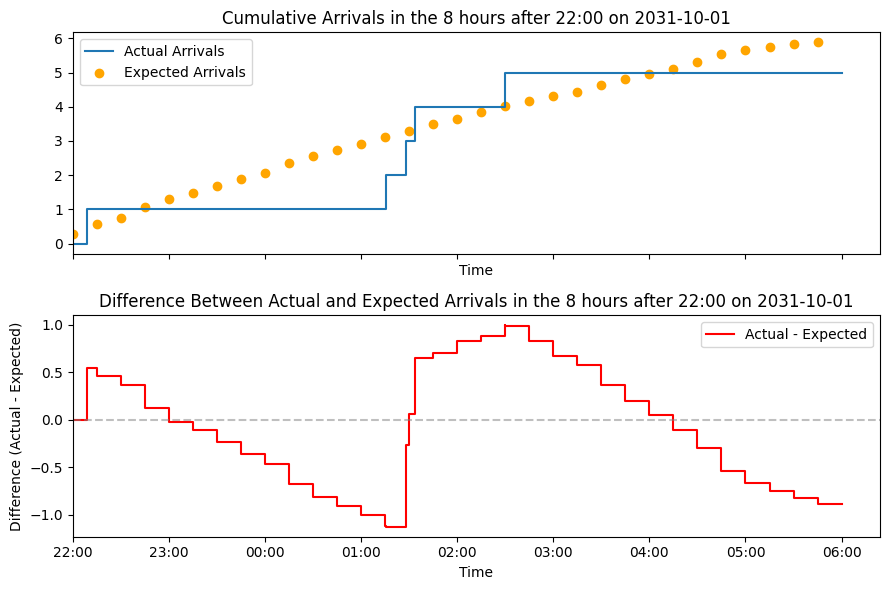
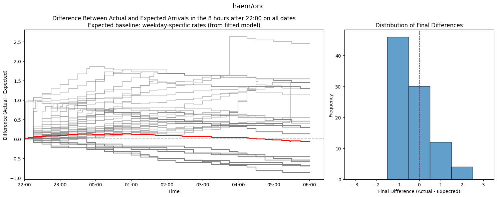
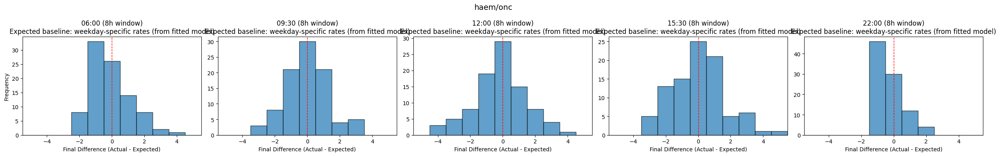
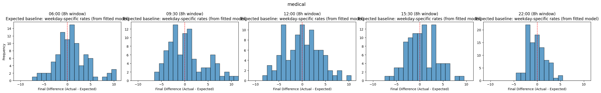
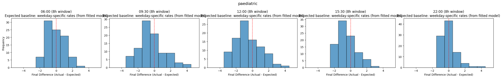
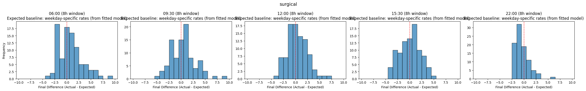
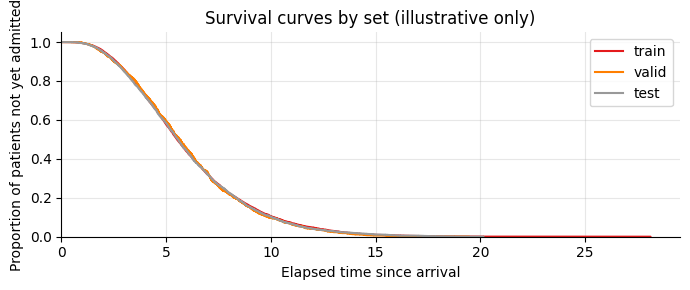
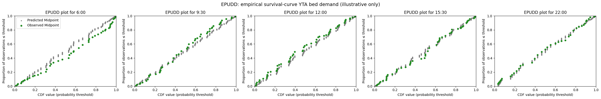

# 3f. Evaluate demand predictions for patients yet to arrive

In notebook 3e I predicted yet-to-arrive demand from historical arrival rates and admission-in-window probabilities. Here I evaluate two parts of that pipeline:

1. **Arrival rates** — do learned front-door arrival rates match observed arrivals in the test set?
2. **Survival-curve bed demand** — of patients who arrive, how many get a ward bed within the prediction window? I fit `EmpiricalIncomingAdmissionPredictor` and check the resulting PMFs with EPUDD on the same `inpatient_arrivals` extract.

### Data requirements

| Column / dataset                                                                                              | Used for                                    |
| ------------------------------------------------------------------------------------------------------------- | ------------------------------------------- |
| `inpatient_arrivals.arrival_datetime`                                                                         | Arrival-rate delta plots (section 1)        |
| `arrival_datetime` plus ward-admission time (`admitted_to_ward_datetime`, or `departure_datetime` as a proxy) | Survival-curve bed-demand EPUDD (section 2) |

The public UCLH extract on [Zenodo](https://zenodo.org/records/14866057) includes arrivals but not ward-admission times, so section 1 runs on real data while section 2 needs a workaround. Section 2 still runs on that extract: it adds a synthetic `departure_datetime` with `synthesise_departure_times` so you can see the workflow end-to-end. **Treat EPUDD output on public data as illustration only** — the ward times are fabricated and are not paired with real admission delays.

If your own extract includes ward-admission times, set `WARD_ADMISSION_COL` in section 2 to that column name.

If you do not have the public data, set `data_folder_name` to `'data-synthetic'`.

For systematic evaluation with `patientflow.evaluate` (`EvaluationInputsBuilder` and `run_evaluation`), see notebook **4d**.

```python
# Reload functions every time
%load_ext autoreload
%autoreload 2

```

## Load data and train models

```python
from datetime import timedelta

from patientflow.prepare import create_temporal_splits
from patientflow.train.emergency_demand import prepare_prediction_inputs

data_folder_name = "data-public"
prediction_inputs = prepare_prediction_inputs(data_folder_name, verbose=False)

ed_visits = prediction_inputs["ed_visits"]
inpatient_arrivals = prediction_inputs["inpatient_arrivals"]
yta_model = prediction_inputs["yta_model"]
params = prediction_inputs["config"]

start_training_set = params["start_training_set"]
start_validation_set = params["start_validation_set"]
start_test_set = params["start_test_set"]
end_test_set = params["end_test_set"]
prediction_window = timedelta(minutes=params["prediction_window"])
yta_time_interval = timedelta(minutes=params["yta_time_interval"])

inpatient_arrivals = inpatient_arrivals.copy()
inpatient_arrivals["arrival_datetime"] = __import__("pandas").to_datetime(
    inpatient_arrivals["arrival_datetime"], utc=True
)
_, _, test_inpatient_arrivals_df = create_temporal_splits(
    inpatient_arrivals,
    start_training_set,
    start_validation_set,
    start_test_set,
    end_test_set,
    col_name="arrival_datetime",
    verbose=False,
)

test_snapshot_dates = [
    d.date()
    for d in __import__("pandas").date_range(
        start_test_set, end_test_set, freq="D", inclusive="left"
    )
]

```

## 1. Evaluate arrival rates

Here I compare arrival rates learned from the training set against observed arrivals during the test set.

First I show a single-date arrival comparison, then a multi-date delta **timeline with an embedded histogram** for one specialty and prediction time.

```python
from patientflow.viz.observed_against_expected import (
    plot_arrival_delta_single_instance,
    plot_arrival_delta_timelines,
    plot_arrival_deltas,
)

plot_arrival_delta_single_instance(
    test_inpatient_arrivals_df,
    prediction_time=(22, 0),
    snapshot_date=start_test_set,
    show_delta=True,
    prediction_window=prediction_window,
    yta_time_interval=yta_time_interval,
    fig_size=(9, 3),
    show=True,
)

example_specialty = sorted(yta_model.weights.keys())[0]
plot_arrival_delta_timelines(
    test_inpatient_arrivals_df[
        test_inpatient_arrivals_df["specialty"] == example_specialty
    ],
    prediction_time=(22, 0),
    snapshot_dates=test_snapshot_dates,
    prediction_window=prediction_window,
    yta_time_interval=yta_time_interval,
    arrival_rate_model=yta_model,
    filter_key=example_specialty,
    suptitle=example_specialty,
    show=True,
)

```





The following charst show one row per hospital service, with a histogram panel for each prediction time, across snapshot dates in the test period.

```python
prediction_times = sorted(
    ed_visits.prediction_time.unique(),
    key=lambda x: x[0] * 60 + x[1],
)

for specialty in sorted(yta_model.weights.keys()):
    spec_test_df = test_inpatient_arrivals_df[
        test_inpatient_arrivals_df["specialty"] == specialty
    ]
    plot_arrival_deltas(
        spec_test_df,
        prediction_times,
        test_snapshot_dates,
        prediction_window=prediction_window,
        yta_time_interval=yta_time_interval,
        arrival_rate_model=yta_model,
        filter_key=specialty,
        suptitle=specialty,
        show=True,
    )

```









## 2. Evaluate survival-curve bed demand

Here I fit `EmpiricalIncomingAdmissionPredictor` on the time from arrival to ward admission, build bed-count PMFs with `get_prob_dist_using_survival_curve`, and compare them to observed counts with EPUDD — all on the same `inpatient_arrivals` table loaded above.

On the public Zenodo extract, `WARD_ADMISSION_COL` is not present, so the next cell synthesises `departure_datetime` for illustration. If your extract already has ward-admission times, set `WARD_ADMISSION_COL` to that column instead.

```python
import pandas as pd
from patientflow.aggregate import get_prob_dist_using_survival_curve
from patientflow.generate import synthesise_departure_times
from patientflow.load import get_model_key
from patientflow.predictors.incoming_admission_predictors import (
    EmpiricalIncomingAdmissionPredictor,
)
from patientflow.viz.epudd import plot_epudd
from patientflow.viz.survival_curve import plot_admission_time_survival_curve

# Set to your ward-admission column when the extract includes real timestamps.
WARD_ADMISSION_COL = "admitted_to_ward_datetime"

arrivals = inpatient_arrivals.copy()
using_synthetic_ward_times = WARD_ADMISSION_COL not in arrivals.columns
if using_synthetic_ward_times:
    arrivals = synthesise_departure_times(
        arrivals, kind="inpatient_arrivals", seed=42
    )
    WARD_ADMISSION_COL = "departure_datetime"
    print(
        "Public extract: added synthetic departure_datetime for illustration only."
    )

illustration_suffix = " (illustrative only)" if using_synthetic_ward_times else ""

arrivals["arrival_datetime"] = pd.to_datetime(arrivals["arrival_datetime"], utc=True)
arrivals[WARD_ADMISSION_COL] = pd.to_datetime(arrivals[WARD_ADMISSION_COL], utc=True)

train_arrivals, valid_arrivals, test_arrivals = create_temporal_splits(
    arrivals,
    start_training_set,
    start_validation_set,
    start_test_set,
    end_test_set,
    col_name="arrival_datetime",
    verbose=False,
)

train_indexed = train_arrivals.copy()
train_indexed.set_index("arrival_datetime", inplace=True)

yta_model_empirical = EmpiricalIncomingAdmissionPredictor(verbose=False)
_ = yta_model_empirical.fit(
    train_indexed,
    yta_time_interval=yta_time_interval,
    num_days=(start_validation_set - start_training_set).days,
    start_time_col="arrival_datetime",
    end_time_col=WARD_ADMISSION_COL,
    stratify_by_weekday=True,
)

plot_admission_time_survival_curve(
    [train_arrivals, valid_arrivals, test_arrivals],
    labels=["train", "valid", "test"],
    start_time_col="arrival_datetime",
    end_time_col=WARD_ADMISSION_COL,
    title=f"Survival curves by set{illustration_suffix}",
    ylabel="Proportion of patients not yet admitted",
    xlabel="Elapsed time since arrival",
    figsize=(7, 3),
    return_df=False,
)

prediction_times_sorted = sorted(
    ed_visits.prediction_time.unique(),
    key=lambda x: x[0] * 60 + x[1],
)
prob_dist_dict_all = {}
for prediction_time in prediction_times_sorted:
    model_key = get_model_key("yet_to_arrive", prediction_time)
    prob_dist_dict_all[model_key] = get_prob_dist_using_survival_curve(
        snapshot_dates=test_snapshot_dates,
        test_visits=test_arrivals,
        category="unfiltered",
        prediction_time=prediction_time,
        prediction_window=prediction_window,
        start_time_col="arrival_datetime",
        end_time_col=WARD_ADMISSION_COL,
        model=yta_model_empirical,
        verbose=False,
    )

plot_epudd(
    prediction_times_sorted,
    prob_dist_dict_all,
    model_name="yet_to_arrive",
    suptitle=f"EPUDD: empirical survival-curve YTA bed demand{illustration_suffix}",
    plot_all_bounds=False,
)

```

    Public extract: added synthetic departure_datetime for illustration only.





## Summary

In this notebook I have shown how to evaluate yet-to-arrive demand predictions from notebook 3e. I first checked whether front-door arrival rates learned on the training set still match observed arrivals in the test set, using delta plots by hospital service.

I then ran the survival-curve bed-demand workflow on the same `inpatient_arrivals` extract: fit `EmpiricalIncomingAdmissionPredictor`, build PMFs with `get_prob_dist_using_survival_curve`, and check them with EPUDD. On the public Zenodo extract, ward-admission times are synthesised so the code path is visible; those EPUDD plots are for illustration only.

For systematic multi-component evaluation with `patientflow.evaluate` (`EvaluationInputsBuilder` and `run_evaluation`), see notebook **4d**.

In the notebooks that follow, prefixed with 4, I demonstrate how these functions are assembled into a production system at University College London Hospital to predict emergency demand.
