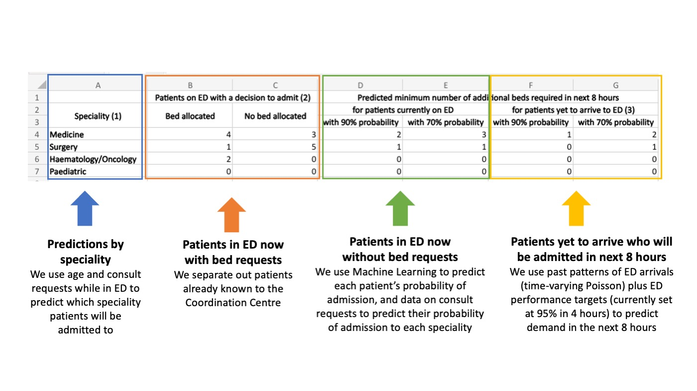

# Specify an emergency demand model

In [the first notebook](1_Meet_the_users_of_our_predictions.md) I introduced bed managers and their work. Here I talk about what they need from predictions of emergency demand, and explain choices we made to make the model useful to them.

## What is 'emergency demand for beds'?

There are two ways people are admitted to hospital: 

* planned (or elective) admissions 
* emergency admissions, typically through the Accident & Emergency Department, which is referred to by hospitals as the ED (Emergency Department). Some patients are admitted after visiting Same Day Emergency Care (SDEC). Here, we refer to the combined ED and SDEC as the ED, since this what UK hospitals typically refer to. 

Emergencies are, by definition, unplanned. Most people are discharged after visiting the ED or SDEC, but about 10% are admitted to an emergency bed. This is referred to as 'emergency demand for beds'

## Why is modelling emergency demand for beds important?

Hospitals find it useful to predict how many beds they need on a given day because:
* they must make sure they do not admit more people than they can safely care for. If they think they can no longer provide safe care, they take measures like diverting ambulances to other hospitals or cancelling planned procedures
* this planning has to take account of emergency patients who have not arrived yet as well as those currently in the ED or SDEC who will need admission
* knowing levels of demand helps plan for best use of resources like staffing
* if they know which specialties are in demand, they can take steps to discharge more patients from those areas

The demand for emergency beds varies:
* by time of day, day of week and season
* in terms of the acuity of the patients - how sick they are
* in terms of which specialty they need to be admitted to - medical, surgical, paediatric etc

Hospitals typically predict emergency demand using simple heuristics eg taking yesterday's emergency bed numbers and assuming today will be the same.

However, now that hospitals have Electronic Health Records (EHRs) patient records, they could do more with real-time data. Typically, bed planners know about new demand only when a staff member in the ED creates a bed request for an incoming patients. By that time, the patient may have been in the ED for hours. Real-time data means that bed planners could be notified much earlier


## What are our users' needs from predictive models of emergency demand?

Over the years of working with the bed managers in the UCLH Coordination Centre, I have come to understand what works best for them in predicting emergency demand. 

* They want information at specific times of day to coincide with their flow huddles, with an 8-hour view of incoming demand at these times
* The 8-hour view needs to take account of patients who are yet to arrive, who should be admitted within that time
* The predictions should be based on the assumption that the ED is meeting its 4-hour targets for performance (for example, 78% of patients are to be admitted within 4 hours of arriving at the front door)
* The predictions should exclude patients who already have decisions to admit under a specialty, since these should be counted as known demand for that specialty
* That they are more concerned about overall bed numbers than whether any individual patient will be admitted
* A breakdown by speciality of admission is more actionable than overall numbers for the whole hospital
* They use email and spreadsheets for communication, both to receive information, and to communicate to others about the hospital bed state 

In our conversations about the predicted number of beds needed, our users said they wanted certainty. In reality, the number of admissions has a natural variation from one day to the next; mathmeticians refer to it as a stochastic process. My Operational Research colleagues use probability distributions to describe this variation. Our users are not interested in seeing whole probability distributions, but they do want a sense of confidence in the predictions. We needed to find a middle ground between showing the whole distribution and showing a single number. 

For more information about these requirements, and how we tailored the UCLH application to meet them, check out this talk by me, with Craig Wood, bed manager at UCLH, at the Health and Care Analytics Conference 2023:

<a href="https://www.youtube.com/watch?v=1V1IzWmOyX8" target="_blank">
    
</a>


## How did I implement these requirements in the UCLH application?

Based on the requirements above, my colleagues and I made the following decisions about the modelling. 

- Train the models such that they are tailored to the times of day at which the bed managers issue their situation reports
- Show output at aggregate level rather than individual 
- Differentiate between patients with and without a decision to admit 
- Provide separate predictions for patients in the ED and SDEC now, and those yet to arrive
- Break down the output by speciality, and by sex
- For the yet to arrive, assume that the time it takes to admit them is achieved by the ED within the target time of 4 hours for a specified percentage of patients (currently UK targets are 78%)
- Give some sense of uncertainty in the predictions (but, because bed managers are not that interested in seeing whole probability distributions, keep this minimal)


The annotated figure below shows the output that our application currently generates at UCLH


```python
from IPython.display import Image
Image(filename='img/thumbnail_UCLH_application.jpg')
```


    

    


This output

- Is sent at five times per day, to coincide with the preparation of the situation reports
- Shows aggregate level rather than individual predictions
- Differentiates between patients with a decision to admit (columns B:C) and those without (columns D:G)
- Provides separate predictions for patients in the ED and SDEC now (columns D:E), and those yet to arrive (columns F:G)
- Breaks down the output by speciality (rows 4:7); a forthcoming version will break down by sex
- For the yet to arrive, assumes that the time it takes to admit them is achieved by the ED within the target time of 4 hours for a specified percentage of patients (currently UK targets are 78% but we are using the former target of 95% currently)
- Gives some sense of uncertainty in the predictions but showing the minimum number of beds needed with 90% probability (columns D and F) and with 70% probability (columns E and G)

The remaining notebooks will break down each step showing how this has been done. 

## Learn more about the modelling approach

I recorded this webinar to demonstrate how we converted data from the UCLH Electronic Health Record in a form suitable for this modelling. I provide detail about all the modelling steps mentioned above. 

<a href="https://www.youtube.com/watch?v=ha_zckz3_rU" target="_blank">
    
</a>


