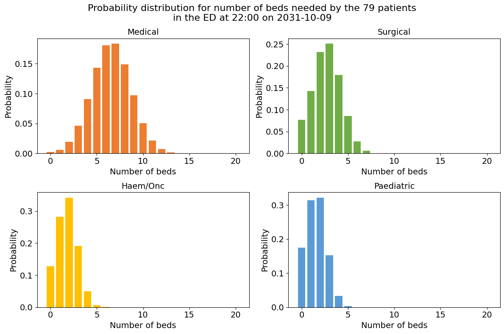
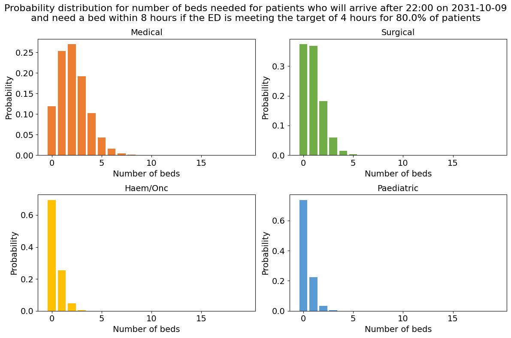

# 4c. Predict emergency demand

This notebook demonstrates the full implementation in code. I show how we used these building blocks in our application at University College London Hospital (UCLH) to predict emergency demand for beds, by service, over the next 8 hours.

The notebook first loads data and trains models. This code is repeated from previous notebooks. It then demonstrates the logic used to generate predictions for real-time inference.

The predictions combine two sources of demand:

**Section 1: Patients currently in the ED** - We predict the probability that each patient will be admitted, which service they will be admitted to, and whether they will be admitted within the prediction window. This section includes **a step-through in Python** demonstrating the real-time inference steps, showing how predictions are generated for current ED patients by combining admission probabilities, specialty assignments, and admission window probabilities.

**Section 2: Patients yet to arrive** - We predict the expected number of patients who will arrive at the ED and need admission within the prediction window, by service. Again, this section includes **a step-through in Python** demonstrating the real-time inference steps.

**Section 3: Production prediction pipeline** - Using the data classes introduced in [notebook 4a](4a_Organise_predictions_for_a_production_pipeline.md) (`FlowInputs`, `ServicePredictionInputs`, `DemandPredictor`, `FlowSelection`, `PredictionBundle`), I show how `build_service_data` encapsulates all the step-through logic into a single function call for real-time inference.

Sections 1–3 use an **aspirational approach** to predicting demand for beds within the prediction window, assuming that ED four-hour targets are met via parametric curves based on specified ED performance targets.

**Appendix: Legacy approaches** - For backward compatibility, I show the original `create_predictions` function, including an alternative approach **informed by past performance** that uses empirical survival curves instead of ED targets.

## Load data and prepare for model training

I'm going to use real patient data from UCLH to demonstrate the implementation. 

You can request the datasets that are used here on [Zenodo](https://zenodo.org/records/14866057). Alternatively you can use the synthetic data that has been created from the distributions of real patient data. If you don't have the public data, change the argument in the cell below from `data_folder_name='data-public'` to `data_folder_name='data-synthetic'`.

The parameters used in training and inference are set in config.yaml in the root of the repository and loaded by `load_config_file()`


```python
# Reload functions every time
%load_ext autoreload 
%autoreload 
```


```python
import pandas as pd
from patientflow.load import load_data, set_project_root
from patientflow.load import set_file_paths
from patientflow.prepare import create_temporal_splits
from patientflow.load import load_config_file

# set file paths
project_root = set_project_root()
data_folder_name = 'data-public'
data_file_path = project_root / data_folder_name

data_file_path, media_file_path, model_file_path, config_path = set_file_paths(
    project_root, 
    data_folder_name=data_folder_name,
    config_file = 'config.yaml', verbose=False)


# load ED snapshots data
ed_visits = load_data(data_file_path, 
                    file_name='ed_visits.csv', 
                    index_column = 'snapshot_id',
                    sort_columns = ["visit_number", "snapshot_date", "prediction_time"], 
                    eval_columns = ["prediction_time", "consultation_sequence", "final_sequence"])
ed_visits.snapshot_date = pd.to_datetime(ed_visits.snapshot_date).dt.date
ed_visits.elapsed_los = pd.to_timedelta(ed_visits.elapsed_los, 'seconds')

# load data on inpatient arrivals
inpatient_arrivals = inpatient_arrivals = load_data(data_file_path, 
                    file_name='inpatient_arrivals.csv')
inpatient_arrivals['arrival_datetime'] = pd.to_datetime(inpatient_arrivals['arrival_datetime'], utc = True)


#  Set modelling parameters
params = load_config_file(config_path)

start_training_set, start_validation_set, start_test_set, end_test_set = params["start_training_set"], params["start_validation_set"], params["start_test_set"], params["end_test_set"]

print(f'\nTraining set starts {start_training_set} and ends on {start_validation_set - pd.Timedelta(days=1)} inclusive')
print(f'Validation set starts on {start_validation_set} and ends on {start_test_set - pd.Timedelta(days=1)} inclusive' )
print(f'Test set starts on {start_test_set} and ends on {end_test_set- pd.Timedelta(days=1)} inclusive' )

# Split data into training, validation and test sets
train_visits_df, valid_visits_df, test_visits_df = create_temporal_splits(
    ed_visits,
    start_training_set,
    start_validation_set,
    start_test_set,
    end_test_set,
    col_name="snapshot_date",
)

train_inpatient_arrivals_df, _, _ = create_temporal_splits(
    inpatient_arrivals,
    start_training_set,
    start_validation_set,
    start_test_set,
    end_test_set,
    col_name="arrival_datetime",
)
```

    Inferred project root: /Users/zellaking/Repos/patientflow


    
    Training set starts 2031-03-01 and ends on 2031-08-31 inclusive
    Validation set starts on 2031-09-01 and ends on 2031-09-30 inclusive
    Test set starts on 2031-10-01 and ends on 2031-12-31 inclusive


    Split sizes: [62071, 10415, 29134]
    Split sizes: [7716, 1285, 3898]


The data has been prepared as a series of snapshots of each patient's data at five moments during the day. These five moments are the times when the bed managers wish to receive predictive models of emergency demand. If a patient arrives in the ED at 4 am, and leaves at 11 am, they will be represented in the 06:00 and 09:30 prediction times. Everything known about a patient is included up until that moment is included in that snapshot.

The predition times are presented as tuples in the form (hour, minute). 

From the output below we can see that there are most snapshots at 15:30 - since afternoons are typically the busiest times in the ED - and least at 06:00. 


```python
print("\nTimes of day at which predictions will be made")
print(ed_visits.prediction_time.unique())
```

    
    Times of day at which predictions will be made
    [(22, 0) (15, 30) (6, 0) (12, 0) (9, 30)]


```python
print("\nNumber of observations for each prediction time")
print(ed_visits.prediction_time.value_counts())
```

    
    Number of observations for each prediction time
    prediction_time
    (15, 30)    35310
    (12, 0)     29942
    (22, 0)     28457
    (9, 30)     17642
    (6, 0)      11984
    Name: count, dtype: int64


## Train models

### Train models for patients currently in the ED


```python

from patientflow.train.classifiers import train_classifier
from patientflow.load import get_model_key

grid = {"n_estimators": [30], "subsample": [0.7], "colsample_bytree": [0.7]} # simple grid for expediency

exclude_from_training_data = [ 'snapshot_date', 'prediction_time','visit_number', 'consultation_sequence', 'specialty', 'final_sequence', ]

ordinal_mappings = {
    "latest_acvpu": ["A", "C", "V", "P", "U"],
    "latest_obs_manchester_triage_acuity": [
        "Blue",
        "Green",
        "Yellow",
        "Orange",
        "Red",
    ],
    "latest_obs_objective_pain_score": [
        "Nil",
        "Mild",
        "Moderate",
        "Severe\\E\\Very Severe",
    ],
    "latest_obs_level_of_consciousness": ["A", "C", "V", "P", "U"],
}

# create a dictionary to store the trained models
admissions_models = {}
model_name = 'admissions'

# Loop through each prediction time
for prediction_time in ed_visits.prediction_time.unique():
    print(f"Training model for {prediction_time}")
    model = train_classifier(
        train_visits=train_visits_df,
        valid_visits=valid_visits_df,
        test_visits=test_visits_df,
        grid=grid,
        exclude_from_training_data=exclude_from_training_data,
        ordinal_mappings=ordinal_mappings,
        prediction_time=prediction_time,
        visit_col="visit_number",
        calibrate_probabilities=True,
        calibration_method="isotonic",
        use_balanced_training=True,
    )
    model_key = get_model_key(model_name, prediction_time)
    
    admissions_models[model_key] = model
```

    Training model for (22, 0)


    Training model for (15, 30)


    Training model for (6, 0)


    Training model for (12, 0)


    Training model for (9, 30)


The `SequencePredictor` is used to train the probability of each patient being admitted to a specialty, if admitted. As shown in the previous notebook, ordered sequences of consult requests (also known as referrals to service) are used to train this model. 

Here a `MultiSubgroupPredictor` wrapper is applied. This will train multiple instances of the `SequencePredictor`, for subgroups of patients. We will train the model to handle paediatric patients as special cases; at UCLH, it is assumed that all patients under 18 on arrival will be admitted to a paediatric specialty.


```python
from patientflow.predictors.sequence_to_outcome_predictor import SequenceToOutcomePredictor
from patientflow.predictors.subgroup_predictor import MultiSubgroupPredictor

def create_subgroup_functions_from_age_group():
    """Create subgroup functions that work with age_group categorical variable."""
    
    def is_paediatric(row):
        return row.get("age_group") == "0-17"
    
    def is_adult(row):
        # All non-paediatric patients are adults
        return row.get("age_group") != "0-17"
    
    return {
        "paediatric": is_paediatric,
        "adult": is_adult,
    }

subgroup_functions = create_subgroup_functions_from_age_group()

spec_model = MultiSubgroupPredictor(
    subgroup_functions=subgroup_functions,
    base_predictor_class=SequenceToOutcomePredictor,
    input_var="consultation_sequence",
    grouping_var="final_sequence",
    outcome_var="specialty",
    min_samples=50,  # Minimum samples required per subgroup
)
spec_model = spec_model.fit(train_visits_df)
```

### Train models for patients yet to arrive

As we are predicting by clinical area we will want the predicted bed counts for patients yet to arrive to be calculated for each separately. A dictionary, here called `specialty_filters`, is used to tell the `ParametricIncomingAdmissionPredictor` which column contains the outcome we want to split by. 


```python
from patientflow.predictors.incoming_admission_predictors import ParametricIncomingAdmissionPredictor
from datetime import timedelta

# set the ED targets
x1, y1, x2, y2 = params["x1"], params["y1"], params["x2"], params["y2"]
prediction_window = timedelta(minutes=params["prediction_window"])
yta_time_interval = timedelta(minutes=params["yta_time_interval"])

specialty_filters = filters={
    'medical': {'specialty': 'medical'},
    'surgical': {'specialty': 'surgical'},
    'haem/onc': {'specialty': 'haem/onc'},
    'paediatric': {'specialty': 'paediatric'}
    }
yta_model_by_spec =  ParametricIncomingAdmissionPredictor(filters = specialty_filters, verbose=False)

# calculate the number of days between the start of the training and validation sets; 
# this is used to calculate daily arrival rates
num_days = (start_validation_set - start_training_set).days

if 'arrival_datetime' in train_inpatient_arrivals_df.columns:
    train_inpatient_arrivals_df.set_index('arrival_datetime', inplace=True)

yta_model_by_spec =yta_model_by_spec.fit(train_inpatient_arrivals_df, 
              prediction_window=prediction_window, 
              yta_time_interval=yta_time_interval, 
              prediction_times=ed_visits.prediction_time.unique(), 
              num_days=num_days )
```

## 1. Make predictions for the group of patients currently in the ED

We now have models trained that we can use to create predicted probability distributions. Here is a detailed step-through of how to use those models to generate predictions at a particular moment. 

To illustrate, I'll pick a random prediction date and time from the test set. 


```python
from patientflow.viz.utils import format_prediction_time
from patientflow.prepare import prepare_patient_snapshots, prepare_group_snapshot_dict

# Set seed
import numpy as np
np.random.seed(42)

# Randomly pick a prediction moment to do inference on
random_row = test_visits_df.sample(n=1)
random_prediction_time = random_row.prediction_time.values[0]
random_prediction_date = random_row.snapshot_date.values[0]

prediction_snapshots = ed_visits[(ed_visits.prediction_time == random_prediction_time) & \
            (ed_visits.snapshot_date == random_prediction_date)]

print(f'Number of adult patients in the ED at {format_prediction_time(random_prediction_time)} on {random_prediction_date}:',
      f'{len(prediction_snapshots[prediction_snapshots.age_group != "0-17"])}')

print(f'Number of patients under the age of 18 in the ED at {format_prediction_time(random_prediction_time)} on {random_prediction_date}:',
      f'{len(prediction_snapshots[prediction_snapshots.age_group == "0-17"])}')

# format patient snapshots for input into the admissions model
X_test, y_test = prepare_patient_snapshots(
    df=prediction_snapshots, 
    prediction_time=random_prediction_time, 
    single_snapshot_per_visit=False,
    visit_col='visit_number'
)

# retrieve the admissions model for the prediction time
admission_model = admissions_models[get_model_key(model_name, random_prediction_time)]

# prepare group snapshots dict to indicate which patients comprise the group we want to predict for
group_snapshots_dict = prepare_group_snapshot_dict(
    prediction_snapshots
    )
```

    Number of adult patients in the ED at 22:00 on 2031-10-09: 69
    Number of patients under the age of 18 in the ED at 22:00 on 2031-10-09: 10


The predicted bed counts for patients in the ED take three probabilities into account for each patient snapshots: 

* probability of being admitted after the ED has ended
* probability of being admitted to each specialty, if admitted
* probability of being admitted within the prediction window, taking into account how much time has elapsed since the patient arrived, and the stated ED targets

To set the ED targets, we use the parameters set in the config file. The config file also specifies the length of the prediction, and (for use later) the length of the discrete intervals used to calculate arrival rates for yet-to-arrive patients.


```python
# set the ED targets
x1, y1, x2, y2 = params["x1"], params["y1"], params["x2"], params["y2"]
prediction_window = timedelta(minutes=params["prediction_window"])
yta_time_interval = timedelta(minutes=params["yta_time_interval"])
```

In the cell below I first calculate `prob_admission_in_window`, the probability of being admitted within the prediction window, given the elapsed time since each patient arrived, and the specified ED targets. 

Then, for each patient snapshot, I calculate 'prob_admission_to_specialty`, the probability of admission to specialty if admitted, by applying the specialty model trained earlier. 

These two probabilities for each patient snapshot are multiplied and the result passed to `get_prob_dist` function as weights. 


```python
import matplotlib.pyplot as plt
from patientflow.viz.probability_distribution import plot_prob_dist
from patientflow.viz.pipeline_plots import create_colour_dict
from patientflow.aggregate import get_prob_dist, model_input_to_pred_proba
from patientflow.calculate.admission_in_prediction_window import calculate_probability
from datetime import timedelta

spec_colour_dict = create_colour_dict()
plot_order = ["medical", "surgical", "haem/onc", "paediatric"]


# Extract pipeline if model is a TrainedClassifier
if hasattr(admission_model, "calibrated_pipeline") and admission_model.calibrated_pipeline is not None:
    ed_pipeline = admission_model.calibrated_pipeline
elif hasattr(admission_model, "pipeline"):
    ed_pipeline = admission_model.pipeline
else:
    ed_pipeline = admission_model

# Get probability of admission after ED
prob_admission_after_ed = model_input_to_pred_proba(prediction_snapshots, ed_pipeline)


# Calculate probability of admission within prediction window using ED targets
prob_admission_in_window = prediction_snapshots.apply(
    lambda row: calculate_probability(
        elapsed_los = row["elapsed_los"], 
        prediction_window = prediction_window,
        x1 = x1,
        y1 = y1,
        x2 = x2,
        y2 = y2
    ),
    axis=1,
)

```

With these probabilities prepared, I now iterate through the specialties to generate predictions for each in turn, and plot them in the charts shown.


```python

# Get specialty probabilities for all patients 
specialty_probs_all = spec_model.predict_dataframe(prediction_snapshots)

# generate and plot predicted bed count distributions for each specialty in a 2x2 grid
fig, axes = plt.subplots(2, 2, figsize=(12, 8))

for ax, specialty in zip(axes.flat, plot_order):

    # Extract probability for this specialty from the pre-computed dictionaries
    prob_admission_to_specialty = specialty_probs_all.apply(
        lambda d, s=specialty: d.get(s, 0.0) if isinstance(d, dict) else 0.0
    )
        
    # Filter patients: only process those with non-zero specialty probability
    non_zero_mask = prob_admission_to_specialty > 0.0
    filtered_indices = prediction_snapshots[non_zero_mask].index
    
    if len(filtered_indices) == 0:
        # No patients for this specialty - create zero PMF
        prob_dist_dict = {
            random_prediction_date: {
                'agg_predicted': pd.DataFrame({"agg_proba": [1.0]}, index=[0]),
                'agg_observed': 0
            }
        }
    else:
        # Filter all probabilities and data for this specialty
        filtered_prob_admission_after_ed = prob_admission_after_ed.loc[filtered_indices]
        filtered_prob_admission_to_specialty = prob_admission_to_specialty.loc[filtered_indices]
        filtered_prob_admission_in_window = prob_admission_in_window.loc[filtered_indices]
        
        # Compute weights for filtered patients
        filtered_weights = (
            filtered_prob_admission_to_specialty * filtered_prob_admission_in_window
        )
        
        # Create filtered group_snapshots_dict for this specialty
        filtered_group_snapshots_dict = {
            random_prediction_date: [idx for idx in group_snapshots_dict[random_prediction_date] 
                                   if idx in filtered_indices]
        }
        
        # Get probability distribution using filtered data
        prob_dist_dict = get_prob_dist(
            filtered_group_snapshots_dict, 
            X_test.loc[filtered_indices], 
            y_test.loc[filtered_indices], 
            admission_model, 
            weights=filtered_weights
        )

    title = specialty.title()
    plot_prob_dist(
        prob_dist_dict[random_prediction_date]['agg_predicted'], 
        title, 
        include_titles=True, 
        truncate_at_beds=20,
        bar_colour=spec_colour_dict["single"].get(specialty, "#5B9BD5"),
        ax=ax,
        text_size=14,
    )

fig.suptitle(
    f'Probability distribution for number of beds needed by the '
    f'{len(prediction_snapshots)} patients\n'
    f'in the ED at {format_prediction_time(random_prediction_time)} '
    f'on {random_prediction_date}',
    fontsize=16,
)
fig.tight_layout()
plt.show()
```


    

    


## 2. Make predictions for patients yet-to-arrive to the ED who will need admission

The trained yet-to-arrive model generates the same distribution for each prediction time, irrespective of day of week, for each specialty. Passing the randomly chosen prediction time, for each specialty, will return the required distributions.


```python
fig, axes = plt.subplots(2, 2, figsize=(12, 8))

for ax, specialty in zip(axes.flat, plot_order):

    prediction_context = {
        specialty: {
            'prediction_time': random_prediction_time
        }
    }

    weighted_poisson_prediction = yta_model_by_spec.predict(prediction_context, x1=x1, y1=y1, x2=x2, y2=y2)
    title = specialty.title()
    plot_prob_dist(weighted_poisson_prediction[specialty], title,  
        include_titles=True,
        truncate_at_beds=20,
        bar_colour=spec_colour_dict["single"].get(specialty, "#5B9BD5"),
        ax=ax,
        text_size=14,
    )

fig.suptitle(
    f'Probability distribution for number of beds needed for patients '
    f'who will arrive after {format_prediction_time((random_prediction_time))} on {random_prediction_date}\n'
    f'and need a bed within 8 hours '
    f'if the ED is meeting the target of {int(x1)} hours for {y1*100}% of patients',
    fontsize=16,
)
fig.tight_layout()
plt.show()
```


    

    


##  3. Production prediction pipeline

In place of the lengthy code shown above, `patientflow` provides a function called `build_service_data` that encapsulates this logic. It assembles the trained models, snapshot data, and configuration parameters into the production data classes introduced in [notebook 4a](4a_Organise_predictions_for_a_production_pipeline.md) — `ServicePredictionInputs` containing `FlowInputs` for each source of demand — ready for use with `DemandPredictor`.

### Use of `build_service_data` from the `predict.service` module

To make demand predictions at a given prediction moment, we call `build_service_data` with the trained models, the snapshot data for that moment, the yet-to-arrive parameters, and the requested prediction window. This single call replaces all of the step-through code above.


```python
from patientflow.predict.service import build_service_data

# select the relevant ED admissions model based on the prediction time
admission_model = admissions_models[get_model_key(model_name, random_prediction_time)]

# convert elapsed_los to timedelta to ensure correct calculation of probability of admission within prediction window
prediction_snapshots_processed = prediction_snapshots.copy(deep=True)
prediction_snapshots_processed['elapsed_los'] = pd.to_timedelta(prediction_snapshots_processed['elapsed_los'], unit='s')

# generate the prediction inputs
prediction_inputs = build_service_data(
    models=(admission_model, None, spec_model, yta_model_by_spec, None, None, None),
    prediction_time=random_prediction_time,
    ed_snapshots=prediction_snapshots_processed,
    inpatient_snapshots=None,  
    specialties=specialty_filters.keys(),
    prediction_window=timedelta(hours=8),
    x1=x1, y1=y1, x2=x2, y2=y2
)

```

The returned object is a dictionary mapping each specialty to a `ServicePredictionInputs` instance (as introduced in [notebook 4a](4a_Organise_predictions_for_a_production_pipeline.md)). Below I show the result for one specialty. The structure handles different types of flow, including elective inflows and discharges. It contains both inflows via the ED (used here), and (not used here) elective admissions, transfers and outflows. The latter show predictions of zero patients when no models are trained.


```python
prediction_inputs['medical']
```


    ServicePredictionInputs(service='medical')
      INFLOWS:
        Admissions from current ED               PMF[3:13]: [0.016, 0.037, 0.074, 0.120, 0.160, 0.176, 0.159, 0.119, 0.073, 0.037] (E=8.0 of 79 patients in ED)
        ED yet-to-arrive admissions              λ = 2.131
        Non-ED emergency admissions              λ = 0.000
        Elective admissions                      λ = 0.000
        Elective transfers from other services   PMF[0:1]: [1.000] (E=0.0)
        Emergency transfers from other services  PMF[0:1]: [1.000] (E=0.0)
      OUTFLOWS:
        Emergency inpatient departures           PMF[0:1]: [1.000] (E=0.0 of 0 emergency patients in service)
        Elective inpatient departures            PMF[0:1]: [1.000] (E=0.0 of 0 elective patients in service)


We now use `DemandPredictor` and `FlowSelection` (both introduced in [notebook 4a](4a_Organise_predictions_for_a_production_pipeline.md)) to generate predictions from these inputs. Here I use `FlowSelection.custom()` to include only patients currently in the ED and exclude all other flows.

The `k_sigma` parameter controls truncation of probability mass — it specifies the maximum level of support (maximum number of beds in our case) to return. This is useful when convolving multiple distributions; for example, if some flows are modelled as Poisson distributions, which are by definition unbounded, this parameter controls where they are capped.


```python
from patientflow.predict.demand import DemandPredictor
from patientflow.predict.demand import FlowSelection 
predictor = DemandPredictor(k_sigma=8.0)

current_ed_bundle = predictor.predict_service(
    inputs=prediction_inputs['medical'],
   flow_selection=FlowSelection.custom(
        include_ed_current=True, # only include patients currently in the ED
        include_ed_yta=False,
        include_non_ed_yta=False,
        include_elective_yta=False,
        include_transfers_in=False,
        include_departures=False,  
        cohort="emergency"
    ))

```

To view the consitutent elements of the bundle, we can print it to get pretty output. A pmf range of 10 values is included in the printed output, centred around the mode. The output also records which flows were included. 


```python
print(current_ed_bundle)
```

    PredictionBundle(service: medical)
      Arrivals:    PMF[3:13]: [0.016, 0.037, 0.074, 0.120, 0.160, 0.176, 0.159, 0.119, 0.073, 0.037] (E=8.0)
      Departures:  PMF[0:1]: [1.000] (E=0.0)
      Net flow:    PMF[3:13]: [0.016, 0.037, 0.074, 0.120, 0.160, 0.176, 0.159, 0.119, 0.073, 0.037] (E=8.0)
      Flows:       selection cohort=emergency inflows(ed_current=True, ed_yta=False, non_ed_yta=False, elective_yta=False, transfers_in=False) outflows(departures=False)


From the bundle, we can extract a probability distribution for the number of beds needed for patients currently in the ED. We can view the expectation, or view the percentiles of the distribution as shown below.


```python
print('For patients currently in the ED:\n')
print(f'Most likely number of beds needed for the medical specialty: {current_ed_bundle.arrivals.mode}')
print(f"Need at least {current_ed_bundle.arrivals.min_beds_with_probability(0.9)} beds with 90% probability")
print(f"Need at least {current_ed_bundle.arrivals.min_beds_with_probability(0.7)} beds with 70% probability")
```

    For patients currently in the ED:
    
    Most likely number of beds needed for the medical specialty: 8
    Need at least 5 beds with 90% probability
    Need at least 7 beds with 70% probability


To derive the yet-to-arrive predictions, we can set the FlowSelection accordingly. 


```python
yet_to_arrive_to_ed_bundle = predictor.predict_service(
    inputs=prediction_inputs['medical'],
   flow_selection=FlowSelection.custom(
        include_ed_current=False,
        include_ed_yta=True, # only include yet-to-arrive patients
        include_non_ed_yta=False,
        include_elective_yta=False,
        include_transfers_in=False,
        include_departures=False,  
        cohort="emergency"
    ))
```


```python
print('For patients yet-to-arrive to the ED:\n')
print(f'Most likely number of beds needed for the medical specialty: {yet_to_arrive_to_ed_bundle.arrivals.mode}')
print(f"Need at least {yet_to_arrive_to_ed_bundle.arrivals.min_beds_with_probability(0.9)} beds with 90% probability")
print(f"Need at least {yet_to_arrive_to_ed_bundle.arrivals.min_beds_with_probability(0.7)} beds with 70% probability")
```

    For patients yet-to-arrive to the ED:
    
    Most likely number of beds needed for the medical specialty: 2
    Need at least 0 beds with 90% probability
    Need at least 1 beds with 70% probability


```python
title = (
    f'Probability distribution for number of medical beds needed within {int(prediction_window.total_seconds()/3600)} hours\n'
    f' by the patients in the ED at {format_prediction_time(random_prediction_time)} '
    f'on {random_prediction_date} and those yet to arrive'
)

bundle = predictor.predict_service(
    inputs=prediction_inputs['medical'],
    flow_selection=FlowSelection.custom(
        include_ed_current=True,
        include_ed_yta=True, #only change is setting include_ed_yta to True
        include_non_ed_yta=False,
        include_elective_yta=False,
        include_transfers_in=False,
        include_departures=False,  # No departures
        cohort="emergency"
    ))
    
plot_prob_dist(bundle.arrivals.probabilities, title, 
    include_titles=True, truncate_at_beds=20,
    probability_levels=[0.7,0.9],
    show_probability_thresholds=True, bar_colour=spec_colour_dict["single"]["medical"])
```


    

    


## Summary

Here I have shown how `patientflow` is used at UCLH to generate predictions of emergency demand for beds in the next 8 hours. There are two elements to the predictions:

* predictions for patients already in the ED
* predictions for patients yet-to-arrive to the ED, who will need admission in the next 8 hours

Both sets of predictions assume specified ED targets are met. 

I showed a full step-through in code to make the logic transparent, then demonstrated how `build_service_data` encapsulates all of this into a single function call, producing the `ServicePredictionInputs` and `FlowInputs` data structures introduced in [notebook 4a](4a_Organise_predictions_for_a_production_pipeline.md). The `DemandPredictor` and `FlowSelection` classes then generate the final predictions.

In the appendix, I show two legacy approaches using the original `create_predictions` function: one using empirical survival curves (instead of ED targets) and one using ED targets directly.

In the next notebook, I show how to evaluate the predictions against the numbers of patients actually admitted.

## Appendix: Legacy approaches (maintained for backward compatibility)

The original implementation at UCLH used a single function, `create_predictions`, to generate demand predictions. This has been superseded by `build_service_data` and `DemandPredictor` (Section 3), but is included here for reference.

The legacy approach uses a `ParametricIncomingAdmissionPredictor` to model yet-to-arrive demand, which assumes that ED targets are met. This is the same assumption used in Sections 1–3 above.

### Legacy `create_predictions` function with ED targets

The `create_predictions` function below combines admission probabilities, specialty assignments, and yet-to-arrive predictions into a single call. It uses parametric curves based on specified ED performance targets to calculate the probability that each patient will be admitted within the prediction window.


```python
from patientflow.predict.emergency_demand import create_predictions

create_predictions(
    models = (admission_model, spec_model, yta_model_by_spec),
    prediction_time = random_prediction_time,
    prediction_snapshots = prediction_snapshots_processed,
    specialties = ['medical', 'surgical', 'haem/onc', 'paediatric'],
    prediction_window = timedelta(hours=8),
    cdf_cut_points =  [0.7, 0.9], 
    x1 = x1,
    y1 = y1,
    x2 = x2, 
    y2 = y2)
```


    {'medical': {'in_ed': [7, 5], 'yet_to_arrive': [1, 0]},
     'surgical': {'in_ed': [3, 1], 'yet_to_arrive': [0, 0]},
     'haem/onc': {'in_ed': [1, 0], 'yet_to_arrive': [0, 0]},
     'paediatric': {'in_ed': [1, 0], 'yet_to_arrive': [0, 0]}}


### Alternative: using an empirical survival curve

Not all hospitals set ED performance targets, or you may prefer predictions that reflect actual past performance rather than aspirational targets. In this case, the probability of admission within the prediction window can be calculated from an empirical survival curve fitted to historical data.

Below I show how a survival curve is constructed and used with the legacy `create_predictions` function. This approach replaces the parametric curve with an `EmpiricalIncomingAdmissionPredictor`.


```python
## Add synthetic value for admitted_to_ward_datetime to the dataset, if not available

import numpy as np

if 'admitted_to_ward_datetime' not in train_inpatient_arrivals_df.columns:

    scale_hours = 12  # Average length of stay in hours
    length_of_stay_minutes = np.random.exponential(scale=scale_hours * 60, size=len(train_inpatient_arrivals_df))

    # Clip to reasonable bounds (1 hour minimum, 2 days maximum)
    length_of_stay_minutes = np.clip(length_of_stay_minutes, 0, 5 * 24 * 60)

    train_inpatient_arrivals_df['admitted_to_ward_datetime'] = [
        arrival + pd.Timedelta(minutes=los)
        for arrival, los in zip(train_inpatient_arrivals_df.index, length_of_stay_minutes)
    ]


```


```python
from patientflow.viz.survival_curve import plot_admission_time_survival_curve
title = 'Survival curve showing probability of still being in the ED after a given elapsed time since arrival'
survival_df = plot_admission_time_survival_curve(train_inpatient_arrivals_df.reset_index(), 
                                   start_time_col="arrival_datetime",
                                   end_time_col="admitted_to_ward_datetime",
                                   title=title,
                                   ylabel='Proportion of patients not yet admitted',
                                   xlabel='Elapsed time since arrival',
                                   target_hours=[4, 8],
                                   annotation_string="{:.1%} of patients admitted\nby {:.0f} hours",
                                   return_df=True,
                                   return_figure=False
)
```


    

    


`patientflow` includes a function to look up the probability of admission within a prediction window, using the survival curve. This is demonstrated below. It is used in the `create_predictions` function if the optional parameter `use_admission_in_window_prob` is set.


```python
from patientflow.calculate.admission_in_prediction_window import calculate_admission_probability_from_survival_curve

prob_admission_in_window_from_survival_curve = calculate_admission_probability_from_survival_curve(
    elapsed_los = timedelta(hours=1), 
    prediction_window = prediction_window,
    survival_df = survival_df
)

print(f'Probability of admission in prediction window of {prediction_window.total_seconds() / 3600:.0f} hours, assuming patient has been in ED for 1 hour: {prob_admission_in_window_from_survival_curve:.2}')
```

    Probability of admission in prediction window of 8 hours, assuming patient has been in ED for 1 hour: 0.48


For an array of patients, the probability of admission within the window would be created as shown below.


```python
from patientflow.calculate.admission_in_prediction_window import calculate_admission_probability_from_survival_curve

# Calculate probability of admission within prediction window using ED targets
prob_admission_in_window_from_survival_curve = prediction_snapshots.apply(
    lambda row: calculate_admission_probability_from_survival_curve(
        elapsed_los = row["elapsed_los"], 
        prediction_window = prediction_window,
        survival_df = survival_df
    ),
    axis=1,
)

```

Predictions are created using the legacy approach. 


```python
from patientflow.predict.emergency_demand import create_predictions
from patientflow.predictors.incoming_admission_predictors import EmpiricalIncomingAdmissionPredictor

# First I'll train the empirical yet-to-arrive model
train_inpatient_arrivals_df_copy = train_inpatient_arrivals_df.copy(deep=True)

num_days = (start_validation_set - start_training_set).days

# the arrival_datetime column needs to be set as the index of the dataframe
if 'arrival_datetime' in train_inpatient_arrivals_df_copy.columns:
    train_inpatient_arrivals_df_copy.set_index('arrival_datetime', inplace=True)

specialty_filters = filters={
    'medical': {'specialty': 'medical'},
    'surgical': {'specialty': 'surgical'},
    'haem/onc': {'specialty': 'haem/onc'},
    'paediatric': {'specialty': 'paediatric'}
    }

yta_model_by_spec_empirical =  EmpiricalIncomingAdmissionPredictor(filters = specialty_filters, verbose=False)
yta_model_by_spec_empirical.fit(train_inpatient_arrivals_df_copy, 
                        prediction_window=prediction_window, 
                        yta_time_interval=yta_time_interval, 
                        prediction_times=ed_visits.prediction_time.unique(), 
                        num_days=num_days,
                        start_time_col='arrival_datetime',
                        end_time_col='admitted_to_ward_datetime')

models = (admission_model, spec_model, yta_model_by_spec_empirical)

# convert elapsed_los to timedelta to ensure correct calculation of probability of admission within prediction window
prediction_snapshots['elapsed_los'] = pd.to_timedelta(prediction_snapshots['elapsed_los'], unit='s')

create_predictions(
    models = models,
    prediction_time = random_prediction_time,
    prediction_snapshots = prediction_snapshots,
    specialties = ['medical', 'surgical', 'haem/onc', 'paediatric'],
    prediction_window = prediction_window,
    cdf_cut_points =  [0.7, 0.9], 
    x1 = x1,
    y1 = y1,
    x2 = x2, 
    y2 = y2,
    use_admission_in_window_prob = True)
```


    {'medical': {'in_ed': [3, 2], 'yet_to_arrive': [0, 0]},
     'surgical': {'in_ed': [1, 0], 'yet_to_arrive': [0, 0]},
     'haem/onc': {'in_ed': [0, 0], 'yet_to_arrive': [0, 0]},
     'paediatric': {'in_ed': [0, 0], 'yet_to_arrive': [0, 0]}}


