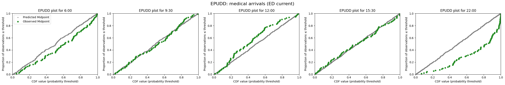

# 4d. Evaluate demand predictions

In the 3x\_ notebooks, I showed how to evaluate individual model components in isolation: group snapshot predictions (3b), bed demand by hospital service (3d), and demand from patients yet to arrive (3f). Each of those notebooks contained evaluation functions for one component at a time.

In this notebook, I show how to evaluate all components of a configured pipeline in a uniform, systematic way — with the goal of being able to segment the evaluation by flow type, cohort, or service. The same evaluation methods are used: EPUDD plots, delta plots, MAE/MPE, and arrival rate comparisons. A `run_evaluation` function iterates over services of interest, using the data structures introduced in 4a to control which flow types are evaluated.

## Approach

### 1. Build evaluation dictionaries and visualise

`get_prob_dist_by_service` is called with an explicit `FlowSelection` to produce service-level predicted distributions and observed counts for each prediction time. An EPUDD plot shows the result for one service.

### 2. Prepare evaluation inputs

The prepared dictionaries are reshaped into the canonical input form expected by `run_evaluation(...)`: `service → flow → prediction_time → payload`. Classifier and arrival-rate inputs are assembled alongside.

### 3. Run evaluation

A single call to `run_evaluation(...)` iterates over evaluation targets and services, writing plots and a `scalars.json` summary to a timestamped output directory.

### 4. Review outputs

The run directory structure and sample scalar entries are inspected to verify the outputs.

```python
# Reload functions every time
%load_ext autoreload
%autoreload 2
```

    The autoreload extension is already loaded. To reload it, use:
      %reload_ext autoreload

## Load data and train models

The data loading, configuration, and model training steps are identical to those demonstrated in detail in notebook 4c. Here we use `prepare_prediction_inputs` to perform all of these steps in a single call.

You can request the UCLH datasets on [Zenodo](https://zenodo.org/records/14866057). If you don't have the public data, change `data_folder_name` from `'data-public'` to `'data-synthetic'`.

```python
from patientflow.train.emergency_demand import prepare_prediction_inputs
from patientflow.prepare import create_temporal_splits
from patientflow.load import get_model_key
from datetime import timedelta
import pandas as pd

data_folder_name = "data-public"
prediction_inputs = prepare_prediction_inputs(data_folder_name, verbose=False)

admissions_models = prediction_inputs["admission_models"]
spec_model = prediction_inputs["specialty_model"]
yta_model_by_spec = prediction_inputs["yta_model"]
ed_visits = prediction_inputs["ed_visits"]
inpatient_arrivals = prediction_inputs["inpatient_arrivals"]
params = prediction_inputs["config"]
model_name = "admissions"

x1, y1, x2, y2 = params["x1"], params["y1"], params["x2"], params["y2"]
prediction_window = timedelta(minutes=params["prediction_window"])
yta_time_interval = timedelta(minutes=params["yta_time_interval"])
prediction_times = params["prediction_times"]

start_training_set = params["start_training_set"]
start_validation_set = params["start_validation_set"]
start_test_set = params["start_test_set"]
end_test_set = params["end_test_set"]

_, _, test_visits_df = create_temporal_splits(
    ed_visits, start_training_set, start_validation_set,
    start_test_set, end_test_set, col_name="snapshot_date", visit_col="visit_number",
    verbose=False,
)

inpatient_arrivals = inpatient_arrivals.copy()
inpatient_arrivals["arrival_datetime"] = pd.to_datetime(
    inpatient_arrivals["arrival_datetime"], utc=True
)
_, _, test_inpatient_arrivals_df = create_temporal_splits(
    inpatient_arrivals,
    start_training_set,
    start_validation_set,
    start_test_set,
    end_test_set,
    col_name="arrival_datetime",
    verbose=False,
)

specialties = ["medical", "surgical", "haem/onc", "paediatric"]
```

## 1. Build evaluation dictionaries and visualise

The function `get_prob_dist_by_service` bridges composed service-level predictions with the existing evaluation infrastructure. Unlike `get_prob_dist` and `get_prob_dist_using_survival_curve`, which evaluate a single model component at a time, this function evaluates the composed prediction for one or more services — multiple flows convolved together via `DemandPredictor`. For each snapshot date in the test set it:

1. Extracts the ED (and optionally inpatient) snapshot for the requested prediction time
2. Calls `build_service_data` **once** to produce `ServicePredictionInputs` for all specialties
3. Runs `DemandPredictor.predict_service` with the chosen `FlowSelection` for each requested service
4. Counts actual admissions from the data for each service
5. Returns the result in a `{service: {date: {'agg_predicted': DataFrame, 'agg_observed': int}}}` structure

```python
from patientflow.aggregate import get_prob_dist_by_service
from patientflow.predict.demand import FlowSelection

# Get the unique snapshot dates in the test set
test_snapshot_dates = sorted(test_visits_df["snapshot_date"].unique())
print(f"Test set contains {len(test_snapshot_dates)} unique snapshot dates")

# Choose the flow selection for evaluation.
# Here we evaluate ED-current + yet-to-arrive arrivals.
service_to_evaluate = "medical"
flow_sel = FlowSelection.custom(
    include_ed_current=True,
    include_ed_yta=False,
    include_non_ed_yta=False,
    include_elective_yta=False,
    include_transfers_in=False,
    include_departures=False,
)

# Build evaluation dictionaries for each prediction time.
# get_prob_dist_by_service returns results for all requested services at once,
# so build_service_data is called only once per date (not once per service).
ed_current_prob_dist_by_service = {}

for pt in prediction_times:
    model_key = get_model_key(model_name, pt)
    admission_model = admissions_models[model_key]

    models_tuple = (admission_model, None, spec_model, yta_model_by_spec, None, None, None)

    ed_current_prob_dist_by_service[model_key] = get_prob_dist_by_service(
        snapshot_dates=test_snapshot_dates,
        prediction_time=pt,
        models=models_tuple,
        specialties=specialties,
        prediction_window=prediction_window,
        flow_selection=flow_sel,
        ed_visits=ed_visits,
        x1=x1, y1=y1, x2=x2, y2=y2,
        component="arrivals",
        verbose=True,
    )

print(f"\nBuilt evaluation data for {len(ed_current_prob_dist_by_service)} prediction times, "
      f"{len(specialties)} services each")
```

    Test set contains 92 unique snapshot dates
    prediction_time=(6, 0): 4 services × 92 dates
    prediction_time=(9, 30): 4 services × 92 dates
    prediction_time=(12, 0): 4 services × 92 dates
    prediction_time=(15, 30): 4 services × 92 dates
    prediction_time=(22, 0): 4 services × 92 dates

    Built evaluation data for 5 prediction times, 4 services each

The EPUDD (Evaluating Predictions for Unique, Discrete, Distributions) plot below visualises the prepared distributions for a single service. For a well-calibrated model, the observations should lie close to the diagonal. `run_evaluation(...)` in section 3 produces these plots automatically for all services.

```python
from patientflow.viz.epudd import plot_epudd

# Select the service to plot. The outer dict is keyed by model_key,
# the inner dict by service name.
prob_dist_dict_all = {
    model_key: by_service[service_to_evaluate]
    for model_key, by_service in ed_current_prob_dist_by_service.items()
}

plot_epudd(
    prediction_times=prediction_times,
    prob_dist_dict_all=prob_dist_dict_all,
    model_name=model_name,
    suptitle=f"EPUDD: {service_to_evaluate} arrivals (ED current)",
)
```



## 2. Prepare evaluation inputs

Evaluation is driven by `EvaluationTarget` objects, each specifying a flow type, evaluation mode, and whether the target is aspirational. The full default registry (`get_default_evaluation_targets()`) covers ED flows, non-ED yet-to-arrive, elective arrivals, discharges, and combined net flows. This notebook exercises the subset relevant to the public ED admissions data:

- `ed_current_admission_classifier` — classifier diagnostics
- `ed_current_beds` — distribution (EPUDD + MAE/MPE)
- `ed_yta_arrival_rates` — arrival-rate delta plots
- `ed_yta_beds_aspirational` — aspirational skip (metadata only)

Inputs are assembled in two structures:

- **`classifier_inputs`**: keyed by classifier target name, containing trained models and a test visits dataframe.
- **`flow_inputs_by_service`**: keyed by `service → flow → prediction_time → payload`, containing probability distributions and arrival data prepared in section 1.

```python
from datetime import datetime
from pathlib import Path

from patientflow.evaluate import get_default_evaluation_targets, run_evaluation
from patientflow.load import get_model_key

# Build canonical structure: service -> flow -> prediction_time -> payload
flow_inputs_by_service = {service: {} for service in specialties}

# Map ed_current_beds from get_prob_dist_by_service output.
for pt in prediction_times:
    model_key = get_model_key(model_name, pt)
    by_service = ed_current_prob_dist_by_service.get(model_key, {})
    for service in specialties:
        service_payload = by_service.get(service)
        if service_payload is None:
            continue
        flow_inputs_by_service[service].setdefault("ed_current_beds", {})[pt] = service_payload


def apply_filters(df, filters):
    """Mirror IncomingAdmissionPredictor.filter_dataframe for notebook use."""
    filtered_df = df
    for column, criteria in filters.items():
        if callable(criteria):
            filtered_df = filtered_df[filtered_df[column].apply(criteria)]
        else:
            filtered_df = filtered_df[filtered_df[column] == criteria]
    return filtered_df


# Build service-specific YTA arrival inputs using the trained model's filter keys.
arrivals_by_service = {}
for service, service_filters in yta_model_by_spec.filters.items():
    arrivals_by_service[service] = apply_filters(test_inpatient_arrivals_df, service_filters)

for service in specialties:
    service_arrivals = arrivals_by_service.get(service, test_inpatient_arrivals_df)
    flow_inputs_by_service[service]["ed_yta_arrival_rates"] = {
        pt: {
            "df": service_arrivals,
            "snapshot_dates": test_snapshot_dates,
            "prediction_window": prediction_window,
            "yta_time_interval": yta_time_interval,
        }
        for pt in prediction_times
    }

classifier_inputs = {
    "ed_current_admission_classifier": {
        "trained_models": admissions_models,
        "visits_df": test_visits_df,
        "label_col": "is_admitted",
    }
}

all_targets = get_default_evaluation_targets()
evaluation_targets = {
    key: all_targets[key]
    for key in [
        "ed_current_admission_classifier",
        "ed_current_beds",
        "ed_yta_beds_aspirational",
        "ed_yta_arrival_rates",
    ]
}

print(f"Evaluation targets ({len(evaluation_targets)}):")
for name, target in evaluation_targets.items():
    label = "aspirational" if target.aspirational else target.flow_type
    print(f"  {name}: {target.evaluation_mode} ({label})")

print(f"\nServices: {specialties}")
print(f"Prediction times: {prediction_times}")
```

    Evaluation targets (4):
      ed_current_admission_classifier: classifier (classifier)
      ed_current_beds: distribution (pmf)
      ed_yta_beds_aspirational: aspirational_skip (aspirational)
      ed_yta_arrival_rates: arrival_deltas (special)

    Services: ['medical', 'surgical', 'haem/onc', 'paediatric']
    Prediction times: [(6, 0), (9, 30), (12, 0), (15, 30), (22, 0)]

## 3. Run evaluation

A single call to `run_evaluation(...)` iterates over the evaluation targets and services defined above, writing diagnostic plots and a `scalars.json` summary to an output directory. Evaluation targets without matching inputs are recorded as skipped rather than raising errors.

```python
# run_label = f"notebook4d_{datetime.now().strftime('%Y%m%d_%H%M%S')}"
run_label = "demo"
out = run_evaluation(
    output_root=Path("eval-output"),
    run_label=run_label,
    prediction_times=prediction_times,
    evaluation_targets=evaluation_targets,
    classifier_inputs=classifier_inputs,
    flow_inputs_by_service=flow_inputs_by_service,
    services=specialties,
)

print(out)
```

    {'output_root': 'eval-output/demo', 'run_label': 'demo', 'scalars_path': 'eval-output/demo/scalars.json', 'n_flows': 4, 'n_services': 4, 'prediction_times': ['0600', '0930', '1200', '1530', '2200']}

## 4. Review outputs

The run directory contains classifier-level plots (calibration, discrimination, madcap) and service-level diagnostic plots (EPUDD, observed-vs-expected, arrival deltas), alongside a global `scalars.json`. Below we inspect the directory structure and sample scalar entries for an evaluated target, an aspirational target (skipped by design), and a distribution target.

```python
import json

run_dir = Path(out["output_root"])
scalars_path = Path(out["scalars_path"])

print("Run directory:", run_dir)
print("Scalars path:", scalars_path)


```

    Run directory: eval-output/demo
    Scalars path: eval-output/demo/scalars.json

## Summary

This notebook demonstrates the evaluation workflow for patient flow predictions:

1. **Build and visualise** service-level probability distributions from `get_prob_dist_by_service` (section 1).
2. **Prepare inputs** in the canonical form expected by `run_evaluation(...)` (section 2).
3. **Run evaluation** with a single call that iterates over evaluation targets and services (section 3).
4. **Review outputs** in the timestamped run directory (section 4).

The notebook exercises the ED-relevant evaluation targets available with the public data. The full default target registry (`get_default_evaluation_targets()`) additionally covers discharge classifiers, non-ED yet-to-arrive flows, elective arrivals, and combined net-flow targets.

### Limitations and next steps

- **Validation vs test split selection:** currently deferred; classifier scalars come from persisted model artifacts.
- **Net-flow diagnostics with negative support:** still requires explicit offset-aware plotting support.
- **Hierarchy-level evaluation:** specialty-to-division/hospital aggregation is still a follow-on step.
