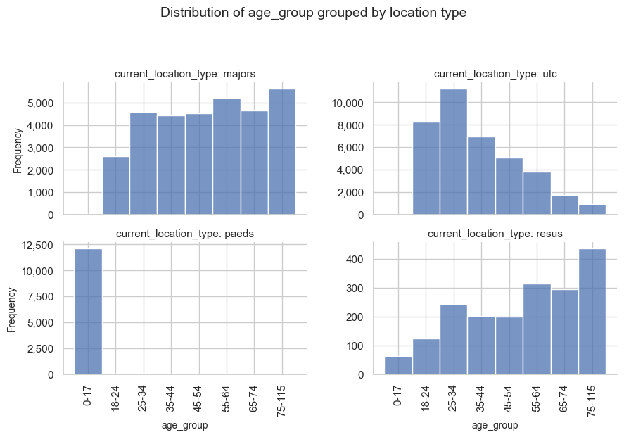
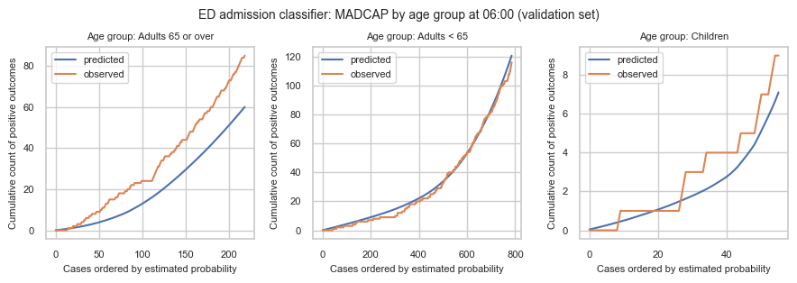
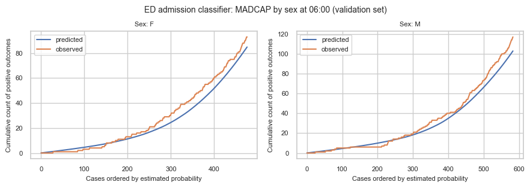
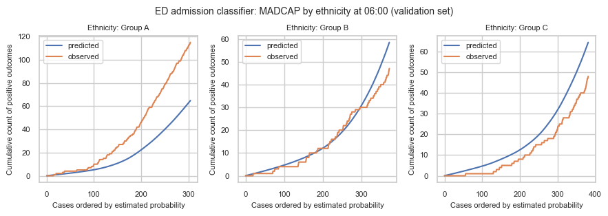

# 4g. Analyse demographic bias

Pooled discrimination and calibration can look fine while performance still differs systematically across patient groups. That is easy to miss on overall plots alone. When subgroup patterns diverge, though, more than one mechanism can produce the same look. Two that matter for emergency demand prediction are introduced below.

## Two mechanisms whereby models encode bias

**1. Case-mix / omitted-attribute divergence.** The model is faithful to the features it was trained on, but an excluded characteristic correlates with legitimate differences in who presents and how (for example differential disease burden or pathways upstream of the ED). Predictions then look systematically different across groups even though the model is doing what it was asked to do. That pattern can reveal a real health inequality in case mix, not necessarily a broken predictor.

**2. Label bias.** The outcome being predicted (`is_admitted`) is a record of a human decision. If that decision varies unfairly by group for the same clinical need, a model calibrated to the label will faithfully reproduce the bias. Against that unfair label, MADCAP can look _well_ calibrated, including within groups, which is what makes this mechanism hard to spot with the usual plots.

Stratified MADCAP is especially useful for mechanism 1. Mechanism 2 is harder to identify with these plots: calibration to the recorded label can look fine while still encoding unfair decisions. Telling the two apart needs clinical and operational judgement, careful handling of sensitive attributes, and usually checks beyond a single chart family.

## Why this matters for demand prediction

In this project, admission probabilities feed bed-count distributions by hospital specialty. If a group is systematically under- or over-predicted, whether from omitted case mix or from a biased label, forecasts for the specialties those patients tend to need will be systematically off, even when overall plots on the wider patient cohort look reasonable.

## Which subgroups should we think about?

A natural starting point is attributes that shape how patients present and which specialties they need, and attributes where unequal model performance would be especially concerning.

Under the UK Equality Act 2010, **age, sex, and race (including ethnicity)** are all protected characteristics. The considerations are not the same for each:

- **Age and sex.** We expect these to affect clinical need and which services a patient is likely to use (for example paediatric versus adult pathways, or differences in admission patterns). They are routinely used as _features_ in clinical prediction and appear in many standard risk scores. That said, their inclusion should always be justified in context, not assumed fine just because it is standard practice. Different case mix by age does not make poor calibration for children or older adults acceptable.
- **Race and ethnicity.** We would _not_ want race or ethnicity to determine which services a patient can access, or how their risk is scored. For **bed-demand forecasting** specifically, ethnicity should not add useful signal beyond the clinical features already in the model, so it is rarely appropriate as a _training feature_ here. It can also encode structural inequities and act as a proxy for other factors. Leaving ethnicity out of training is different from _monitoring_ whether the model performs differently across ethnic groups. Stratifying diagnostics by ethnicity, where the data can be used appropriately, can surface unfair performance without feeding ethnicity into the score.

This notebook never uses ethnicity as a model input. Any artificial ethnicity column below is for evaluation only, and it is synthetic.

## Approach

I load data and train admission classifiers (same helper as notebook **4d**). For mechanism 1 I construct a case-mix / omitted-attribute example and use stratified MADCAP (via `patientflow.evaluate`) to inspect it. For mechanism 2 I discuss label bias: why `is_admitted` can encode unfair decisions, and what that implies for interpretation. I close with implications of going forward when subgroup patterns look wrong, then a short summary.

```python
%load_ext autoreload
%autoreload 2

```

## Load data and train models

Use `prepare_prediction_inputs` as in notebook **4d**. Request the UCLH public extract on [Zenodo](https://zenodo.org/records/14866057), or set `data_folder_name` to `'data-synthetic'`.

```python
from typing import Any
from datetime import timedelta

import pandas as pd

from patientflow.train.emergency_demand import prepare_prediction_inputs
from patientflow.prepare import create_temporal_splits

data_folder_name = "data-public"
prediction_inputs = prepare_prediction_inputs(data_folder_name, verbose=False)

admissions_models = prediction_inputs["admission_models"]
ed_visits = prediction_inputs["ed_visits"]
params = prediction_inputs["config"]

prediction_window = timedelta(minutes=params["prediction_window"])
prediction_times = params["prediction_times"]
prediction_dict = {tuple[Any, ...](pt): prediction_window for pt in prediction_times}

start_training_set = params["start_training_set"]
start_calibration_set = params["start_calibration_set"]
start_validation_set = params["start_validation_set"]
start_test_set = params["start_test_set"]
end_test_set = params["end_test_set"]

eval_split = "valid"

_, _, valid_visits_df, test_visits_df = create_temporal_splits(
    ed_visits,
    start_training_set,
    start_validation_set,
    start_test_set,
    end_test_set,
    col_name="snapshot_date",
    visit_col="visit_number",
    verbose=False,
    start_calibration=start_calibration_set,
)

eval_visits_df = valid_visits_df if eval_split == "valid" else test_visits_df
print(f"{eval_split} cohort: {len(eval_visits_df)} snapshots")
print(f"Admission models: {len(admissions_models)}")

```

    valid cohort: 10415 snapshots
    Admission models: 5

## 1. Mechanism 1: case-mix / omitted-attribute divergence

Here I demonstrate how to investigate mechanism 1. I assign each visit an **artificial ethnicity** label with different admission base rates: membership odds depend on `is_admitted`, so one label is enriched among admitted patients. The classifier never saw this column, so two visits with the same clinical features get the same predicted probability regardless of artificial ethnicity, but by design, admission rates differ by group.

That is a **case-mix / omitted-attribute** illustration, not a claim about any real ethnic group, and not label bias (the admission labels themselves are left unchanged).

```python
import numpy as np


def attach_artificial_ethnicity(
    visits: pd.DataFrame,
    *,
    label_col: str = "is_admitted",
    column: str = "ethnicity",
    labels: tuple[str, ...] = ("Group A", "Group B", "Group C"),
    p_given_admitted: tuple[float, ...] = (0.55, 0.30, 0.15),
    p_given_not_admitted: tuple[float, ...] = (0.20, 0.40, 0.40),
    seed: int = 42,
) -> pd.DataFrame:
    """Attach an artificial ethnicity column with different admission prevalence.

    Group A is over-represented among admitted visits relative to non-admitted
    visits, so Group A has a higher empirical admission rate. Illustration only.
    """
    if abs(sum(p_given_admitted) - 1.0) > 1e-9 or abs(sum(p_given_not_admitted) - 1.0) > 1e-9:
        raise ValueError("Probability tuples must each sum to 1")
    if len(labels) != len(p_given_admitted) or len(labels) != len(p_given_not_admitted):
        raise ValueError("labels and probability tuples must have the same length")

    out = visits.copy()
    rng = np.random.default_rng(seed)
    y = out[label_col].astype(bool).to_numpy()
    assigned = np.empty(len(out), dtype=object)
    n_pos = int(y.sum())
    n_neg = int((~y).sum())
    assigned[y] = rng.choice(labels, size=n_pos, p=p_given_admitted)
    assigned[~y] = rng.choice(labels, size=n_neg, p=p_given_not_admitted)
    out[column] = assigned
    return out


eval_visits_with_ethnicity = attach_artificial_ethnicity(eval_visits_df)

summary = (
    eval_visits_with_ethnicity.groupby("ethnicity", observed=True)["is_admitted"]
    .agg(n="size", admission_rate="mean")
    .sort_index()
)
summary

```

<div>
<style scoped>
    .dataframe tbody tr th:only-of-type {
        vertical-align: middle;
    }

    .dataframe tbody tr th {
        vertical-align: top;
    }

    .dataframe thead th {
        text-align: right;
    }

</style>
<table border="1" class="dataframe">
  <thead>
    <tr style="text-align: right;">
      <th></th>
      <th>n</th>
      <th>admission_rate</th>
    </tr>
    <tr>
      <th>ethnicity</th>
      <th></th>
      <th></th>
    </tr>
  </thead>
  <tbody>
    <tr>
      <th>Group A</th>
      <td>2635</td>
      <td>0.319924</td>
    </tr>
    <tr>
      <th>Group B</th>
      <td>4027</td>
      <td>0.111994</td>
    </tr>
    <tr>
      <th>Group C</th>
      <td>3753</td>
      <td>0.063682</td>
    </tr>
  </tbody>
</table>
</div>

### A worked example: checking whether a feature is a demographic proxy

We don't have real ethnicity data to check directly. But the same concern: a feature that looks operational but carries demographic signal, can be demonstrated with real columns we do have. Here we check whether `current_location_type`, which records where in the department a patient was at snapshot time, is associated with `age_group`.

```python
from patientflow.viz.data_distribution import plot_data_distribution

age_group_order = [
    "0-17",
    "18-24",
    "25-34",
    "35-44",
    "45-54",
    "55-64",
    "65-74",
    "75-115",
]
location_order = ["majors", "utc", "paeds", "resus"]

# Age distribution within main ED locations: is location a proxy for age?
# Use the loaded visits frame (not the artificial-ethnicity eval copy).
ed_visits_main_locs = ed_visits[
    ed_visits["current_location_type"].isin(location_order)
].copy()
ed_visits_main_locs["current_location_type"] = pd.Categorical(
    ed_visits_main_locs["current_location_type"],
    categories=location_order,
    ordered=True,
)

plot_data_distribution(
    ed_visits_main_locs,
    "age_group",
    "current_location_type",
    "location type",
    plot_type="hist",
    rotate_x_labels=True,
    ordinal_order=age_group_order,
    col_wrap=2,
    sharey=False,
    show=True,
)

```



```python
loc_age = pd.crosstab(
    ed_visits_main_locs["current_location_type"],
    ed_visits_main_locs["age_group"],
    normalize="index",
)
print(loc_age.loc[location_order, ["0-17", "18-24", "25-34", "75-115"]].round(3))

```

    age_group               0-17  18-24  25-34  75-115
    current_location_type
    majors                 0.001  0.083  0.145   0.177
    utc                    0.000  0.217  0.295   0.025
    paeds                  0.997  0.001  0.001   0.000
    resus                  0.034  0.066  0.129   0.233

Patients aged 75+ make up about 2.5% of UTC attendances but about 18% of majors and 23% of resus, despite none of those fields being an explicit age rule. One location, `paeds`, is deliberately age-restricted (a paediatric pathway) and should be read separately: its age skew is expected and by design, not evidence of a hidden proxy. The interesting finding is that the non-paediatric locations still carry meaningful age skew.

This is a template, not a conclusion: a feature correlating with a demographic split means it could carry that demographic's information into the model indirectly, even if the demographic itself is never a training feature. It doesn't tell you whether that's a problem in any particular case: that needs clinical and operational judgement about whether the correlation reflects legitimate clinical routing or an unwanted proxy. The same check (plot the candidate feature against the demographic split, read off the skew) can be rerun against real ethnicity data, or any other protected characteristic, if it becomes available where the data can be used appropriately.

### Stratified MADCAP as a diagnostic for mechanism 1

One practical check for case-mix / omitted-attribute divergence is to repeat the MADCAP (Model Accuracy Diagnostic Calibration Plot) view within subgroups. Notebook **2c** did that with hand-rolled `plot_madcap_by_group` on age. Notebook **4d** showed systematic evaluation with `patientflow.evaluate`; here I use that path with **caller-prescribed MADCAP groupings** on `add_classifier`.

`MadcapGrouping` names the visit-frame column, a display label, and the output file stem. When `madcap_groupings` is omitted, evaluate still defaults to age-only (`madcap_by_age.png`). Here I request age, sex, and the artificial ethnicity column. Eval-only columns on `visits_df` are used for stratification charts; modern pipelines drop extras at predict time via `FeatureColumnTransformer`, so they do not become model features unless they were present at training.

```python
from pathlib import Path

from patientflow.evaluate.inputs import (
    EvaluationInputsBuilder,
    EvaluationTarget,
    MadcapGrouping,
)
from patientflow.predict.demand import FlowSelection

MADCAP_CLOCK = (6, 0)
_admission_models = (
    admissions_models.values()
    if isinstance(admissions_models, dict)
    else admissions_models
)
madcap_models = [
    m
    for m in _admission_models
    if tuple(m.training_results.prediction_time) == MADCAP_CLOCK
]
if not madcap_models:
    raise ValueError(f"No admission model for prediction_time={MADCAP_CLOCK}")

madcap_groupings = [
    MadcapGrouping("age_group", "Age group", "madcap_by_age"),
    MadcapGrouping("sex", "Sex", "madcap_by_sex"),
    MadcapGrouping("ethnicity", "Ethnicity", "madcap_by_ethnicity"),
]

evaluation_targets = [
    EvaluationTarget(
        flow_name="ed_admissions_cls",
        flow_type="admissions",
        evaluation_mode="classifier_probability_quality",
        component="classifier_probability_quality",
        observation_mode="admitted_at_some_point",
    ),
]

inputs = (
    EvaluationInputsBuilder(
        flow_selection=FlowSelection.emergency_only(),
        prediction_dict={MADCAP_CLOCK: prediction_dict[MADCAP_CLOCK]},
        eval_split=eval_split,
    )
    .with_evaluation_targets(evaluation_targets)
    .add_classifier(
        flow_name="ed_admissions_cls",
        trained_models=madcap_models,
        visits_df=eval_visits_with_ethnicity,
        label_col="is_admitted",
        madcap_groupings=madcap_groupings,
    )
    .build()
)

print("Registered MADCAP groupings:")
for g in inputs.classifier_by_flow["ed_admissions_cls"]["madcap_groupings"]:
    print(f"  {g.column!r} → {g.file_stem}.png ({g.display_name})")
print(f"Using {len(madcap_models)} model(s) at {MADCAP_CLOCK}")

```

    Registered MADCAP groupings:
      'age_group' → madcap_by_age.png (Age group)
      'sex' → madcap_by_sex.png (Sex)
      'ethnicity' → madcap_by_ethnicity.png (Ethnicity)
    Using 1 model(s) at (6, 0)

`run_evaluation` writes discrimination, overall MADCAP, one stratified MADCAP set per requested grouping, and calibration under a timestamped folder (same pattern as notebook **4d**). Here I restrict to the **06:00** classifier so the panels match the sample-size table below. The next cell runs that evaluation; the cell after plots the stratified MADCAP panels inline for reading in this notebook (without embedding the saved PNG files).

```python
from datetime import datetime

from patientflow.evaluate.runner import run_evaluation

run_name = f"notebook4g_{datetime.now().strftime('%Y%m%d_%H%M%S')}"
out = run_evaluation(
    Path("eval-output"),
    inputs,
    run_name=run_name,
    charts="all",
    training_metadata={
        "start_training_set": str(start_training_set),
        "start_validation_set": str(start_validation_set),
        "start_test_set": str(start_test_set),
        "end_test_set": str(end_test_set),
    },
)
cls_dir = out["run_dir"] / "classifiers" / "ed_admissions_cls"
print(f"Evaluation artefacts in {out['run_dir']}")

```

    Evaluation artefacts in eval-output/notebook4g_20260806_182708

```python
from patientflow.viz.madcap import plot_madcap_by_group

split_label = "validation set" if eval_split == "valid" else f"{eval_split} set"
clock_label = f"{MADCAP_CLOCK[0]:02d}:{MADCAP_CLOCK[1]:02d}"

for grouping in madcap_groupings:
    plot_madcap_by_group(
        madcap_models,
        eval_visits_with_ethnicity,
        grouping_var=grouping.column,
        grouping_var_name=grouping.display_name,
        label_col="is_admitted",
        show=True,
        suptitle=(
            f"ED admission classifier: MADCAP by {grouping.display_name.lower()} "
            f"at {clock_label} ({split_label})"
        ),
    )

```







On the **ethnicity** panels, Group A was given a higher admission prevalence while predictions ignore ethnicity, so you should see a different relationship between cumulative predicted and observed outcomes than in Groups B and C. Age and sex charts use real columns already on the public frame; ethnicity is synthetic. Under mechanism 1 the model need not be "wrong": the divergence can reflect omitted case mix. The chart alone does not prove which mechanism you are seeing.

### How large does a subgroup panel need to be?

Calibration assessments are unstable in thin slices. Work on minimum sample sizes for validating clinical prediction models ([Riley et al., 2021](https://doi.org/10.1002/sim.9025)) suggests calibration assessment needs at least ~100 outcome events in the group being evaluated, and the same paper notes that subgroup-level calibration typically needs more than this floor. So **~100 events is too permissive as a rule for stratified MADCAPs when the groups are small**: treat it as a lower bound for a single validation cohort, not as enough evidence per stratum. For stratified charts, either aim substantially higher per panel before treating the plot as decisive (for example on the order of 200+ admissions if you want flexible calibration-style reading), widen the evaluation window until thin groups accumulate enough events, or treat panels that only clear ~100 events as exploratory, useful for hypothesis generation, not as a green light.

Each stratified MADCAP panel is **one prediction time × one subgroup**. Here we only show the **06:00** charts, so the counts below are for that clock only. The event is admission (`is_admitted`). Translate a chosen event target into visits using **that subgroup's** admission rate:

visits needed ≈ event target / subgroup admission rate

For example, at a 20% admission rate, ~100 admissions need about 500 visits and ~200 admissions need about 1,000. A high-prevalence group needs fewer visits to reach the same event count than a low-prevalence group.

```python
# Cited floor for a validation cohort; too low to treat as enough per subgroup panel.
MIN_EVENTS_FLOOR = 100
# Illustrative stricter target for reading a stratified MADCAP panel as more than exploratory.
MIN_EVENTS_PANEL = 200
MADCAP_CLOCK = (6, 0)

from patientflow.prepare import prepare_patient_snapshots
from patientflow.viz.madcap import classify_age

X_clock, y_clock = prepare_patient_snapshots(
    eval_visits_with_ethnicity,
    prediction_time=MADCAP_CLOCK,
    single_snapshot_per_visit=False,
    label_col="is_admitted",
)
clock_df = X_clock.assign(is_admitted=y_clock)
clock_df["age_band"] = clock_df["age_group"].apply(classify_age)

panel_frames = []
for group_col, label in (
    ("ethnicity", "ethnicity"),
    ("age_band", "age"),
    ("sex", "sex"),
):
    panel = (
        clock_df.groupby(group_col, observed=True)["is_admitted"]
        .agg(n_visits="size", n_admissions="sum", admission_rate="mean")
        .reset_index()
        .rename(columns={group_col: "subgroup"})
    )
    panel.insert(0, "grouping", label)
    panel_frames.append(panel)

panel_n = pd.concat(panel_frames, ignore_index=True)
panel_n.insert(0, "prediction_time", [MADCAP_CLOCK] * len(panel_n))
panel_n["visits_for_floor"] = (
    MIN_EVENTS_FLOOR / panel_n["admission_rate"]
).round().astype(int)
panel_n["visits_for_panel_target"] = (
    MIN_EVENTS_PANEL / panel_n["admission_rate"]
).round().astype(int)
panel_n["clears_floor"] = panel_n["n_admissions"] >= MIN_EVENTS_FLOOR
panel_n["clears_panel_target"] = panel_n["n_admissions"] >= MIN_EVENTS_PANEL
panel_n

```

<div>
<style scoped>
    .dataframe tbody tr th:only-of-type {
        vertical-align: middle;
    }

    .dataframe tbody tr th {
        vertical-align: top;
    }

    .dataframe thead th {
        text-align: right;
    }

</style>
<table border="1" class="dataframe">
  <thead>
    <tr style="text-align: right;">
      <th></th>
      <th>prediction_time</th>
      <th>grouping</th>
      <th>subgroup</th>
      <th>n_visits</th>
      <th>n_admissions</th>
      <th>admission_rate</th>
      <th>visits_for_floor</th>
      <th>visits_for_panel_target</th>
      <th>clears_floor</th>
      <th>clears_panel_target</th>
    </tr>
  </thead>
  <tbody>
    <tr>
      <th>0</th>
      <td>(6, 0)</td>
      <td>ethnicity</td>
      <td>Group A</td>
      <td>305</td>
      <td>115</td>
      <td>0.377049</td>
      <td>265</td>
      <td>530</td>
      <td>True</td>
      <td>False</td>
    </tr>
    <tr>
      <th>1</th>
      <td>(6, 0)</td>
      <td>ethnicity</td>
      <td>Group B</td>
      <td>374</td>
      <td>47</td>
      <td>0.125668</td>
      <td>796</td>
      <td>1591</td>
      <td>False</td>
      <td>False</td>
    </tr>
    <tr>
      <th>2</th>
      <td>(6, 0)</td>
      <td>ethnicity</td>
      <td>Group C</td>
      <td>382</td>
      <td>48</td>
      <td>0.125654</td>
      <td>796</td>
      <td>1592</td>
      <td>False</td>
      <td>False</td>
    </tr>
    <tr>
      <th>3</th>
      <td>(6, 0)</td>
      <td>age</td>
      <td>Adults 65 or over</td>
      <td>219</td>
      <td>85</td>
      <td>0.388128</td>
      <td>258</td>
      <td>515</td>
      <td>False</td>
      <td>False</td>
    </tr>
    <tr>
      <th>4</th>
      <td>(6, 0)</td>
      <td>age</td>
      <td>Adults &lt; 65</td>
      <td>786</td>
      <td>116</td>
      <td>0.147583</td>
      <td>678</td>
      <td>1355</td>
      <td>True</td>
      <td>False</td>
    </tr>
    <tr>
      <th>5</th>
      <td>(6, 0)</td>
      <td>age</td>
      <td>Children</td>
      <td>56</td>
      <td>9</td>
      <td>0.160714</td>
      <td>622</td>
      <td>1244</td>
      <td>False</td>
      <td>False</td>
    </tr>
    <tr>
      <th>6</th>
      <td>(6, 0)</td>
      <td>sex</td>
      <td>F</td>
      <td>477</td>
      <td>93</td>
      <td>0.194969</td>
      <td>513</td>
      <td>1026</td>
      <td>False</td>
      <td>False</td>
    </tr>
    <tr>
      <th>7</th>
      <td>(6, 0)</td>
      <td>sex</td>
      <td>M</td>
      <td>584</td>
      <td>117</td>
      <td>0.200342</td>
      <td>499</td>
      <td>998</td>
      <td>True</td>
      <td>False</td>
    </tr>
  </tbody>
</table>
</div>

At 06:00 none of the ethnicity panels reach the stricter ~200-admission target. **Group A** clears the ~100-event floor (about 115 admissions), so the large predicted-versus-observed gap is worth taking seriously as an exploratory signal, but not as a definitive calibration audit. **Groups B and C** have only about 50 admissions each: below the floor, so those panels are too thin to trust. A quiet-looking line there can be chance; a noisy one is expected.

On the real demographic charts at the same clock, **adults under 65** and **sex** panels clear the floor (and still miss the stricter target), so they are the most readable of the set. **Adults 65+** sit just under the floor (~85 admissions): treat the under-prediction pattern as suggestive, not conclusive. **Children** have only a handful of admissions: do not over-interpret that panel.

## 2. Mechanism 2: label bias

The Mechanism 1 example left the admission outcome alone and varied an omitted attribute: the artificial ethnicity column, which the classifier never saw. **Label bias** is different: the target `is_admitted` is itself a clinical and operational decision. If clinicians admit (or discharge) similar patients differently by group, for example underestimating severity for some patients, then the recorded label is unfair relative to true need. A well-calibrated model on that label will still reproduce the inequity: it learns to predict the biased decision, not an unbiased notion of who needed a bed.

That matters for interpretation:

- Against `is_admitted`, MADCAP can look well calibrated even when the label is unfair: the model is faithful to a biased target.
- Improving calibration to `is_admitted` does not remove label bias; it may entrench it.
- Remediation is not primarily "add ethnicity as a feature" or "fit a better calibrator". It needs scrutiny of the decision process, possibly different outcome definitions, and careful handling of sensitive attributes.

This notebook does **not** fabricate a label-bias example on the public data (that would mean rewriting who was admitted). The point here is to keep the two mechanisms distinct when you read subgroup charts in practice.

## Putting the two mechanisms together

Both mechanisms can leave hospital-wide metrics looking acceptable while some patients are poorly served. The charts and the response differ:

- **If mechanism 1 looks likely** (subgroup MADCAP diverges; the model is faithful to its features; the group difference tracks real case mix or an omitted attribute): treat the chart as a signal about who the model under- or over-serves in forecast terms. Practical next steps include checking sample size in the panel, gathering more data for thin groups, considering whether separate models or richer clinical features are justified, and being explicit with users about uncertainty for that specialty mix, not "fixing" fairness by adding ethnicity as a training feature for bed demand.
- **If mechanism 2 looks likely** (decisions look unfair for similar clinical presentations; MADCAP to `is_admitted` may still look fine): the problem is upstream of the scorer. Practical next steps sit with clinical and operational review of admission decisions, possible alternative outcome definitions closer to need, and careful handling of any use of sensitive attributes in monitoring, not tighter calibration to the biased label.

In practice the two can co-exist. Stratified MADCAP helps with mechanism 1; it will not, on its own, clear mechanism 2. Real monitoring needs real attributes (used appropriately), clinical and operational judgement, and usually checks beyond a single chart family. Patientflow stays column-agnostic: callers prescribe which columns to stratify on.

## Implications of going forward with subgroup bias

Undetected label bias is the harder problem for the checks in this notebook. The model can look well calibrated overall and within groups, including full stratified MADCAP, while systematically reproducing an unfair historical decision pattern. Because the diagnostics look clean, there is no natural trigger to go looking for it. Going live without other scrutiny can amplify existing inequities in who is admitted, even when every plot in sections 1–2 looks fine.

Subgroup diagnostics help with mechanism 1. They do not, on their own, clear mechanism 2.

## Summary

In this notebook I have examined demographic differences in emergency admission predictions in the context of two mechanisms: **case-mix / omitted-attribute divergence** and **label bias**. For mechanism 1 I attached an artificial ethnicity column with different admission prevalence (illustration only, not real demographics), requested stratified MADCAP via caller-prescribed `MadcapGrouping` specs on `add_classifier`, and inspected the charts. For mechanism 2 I discussed why `is_admitted` can encode unfair decisions and why calibrating to that label does not remove the inequity.
